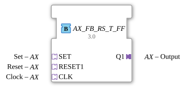

# AX_FB_RS_T_FF

* * * * * * * * * *
## Introduction
The function block **AX_FB_RS_T_FF** implements a reset-dominant bistable latch with an additional toggle function. The block communicates via standardized adapter interfaces and enables flexible integration with other components.
## Interface Structure

The block has no direct event or data inputs/outputs at the FB level. All communication takes place via **adapters**, which in turn provide their own event and data channels.

### **Event Inputs**

The following adapter events trigger processing:

- **SET.E1** – Event to set the output
- **RESET1.E1** – Event to reset the output (priority)
- **CLK.E1** – Event for the clock signal, which triggers a toggle on its rising edge

### **Event Outputs**
- **Q1.E1** – Event sent after each execution of the algorithm (regardless of the result)

### **Data Inputs**

The following data values are received via the adapters:

- **SET.D1** (BOOL) – Set input: `TRUE` → sets Q1 to `TRUE`
- **RESET1.D1** (BOOL) – Reset input: `TRUE` → sets Q1 to `FALSE` (has priority over SET)
- **CLK.D1** (BOOL) – Clock input: Edge transition from `FALSE` to `TRUE` triggers toggle

### **Data Outputs**
- **Q1.D1** (BOOL) – Output value of the flip-flop

### **Adapter**

| Adapter | Type | Role | Comment |

|--------|------|-------|-----------|

| `SET` | adapter::types::unidirectional::AX | Input | Set |

| `RESET1` | adapter::types::unidirectional::AX | Input | Reset |

| `CLK` | adapter::types::unidirectional::AX | Input | Clock |

| `Q1` | adapter::types::unidirectional::AX | Output | Output |

All adapters are of type `AX` (unidirectional) and each provides one event channel (`.E1`) and one data channel (`.D1`).

| `Q1` | | | ] ...
## Functionality

The module operates according to the following deterministic algorithm, which is executed upon each incoming event (SET, RESET1, or CLK):

1. **Priority: Reset Dominates**

If `RESET1.D1 = TRUE` is present, `Q1.D1` is set to `FALSE`.

2. **Otherwise: Set Takes Precedence**

If only `SET.D1 = TRUE` (and `RESET1.D1 = FALSE`) is present, `Q1.D1` is set to `TRUE`.

3. **Otherwise: Toggle on rising edge**

If neither RESET1 nor SET is present, the program checks whether `CLK.D1 = TRUE` was present in the previous cycle and `FALSE` in the previous cycle (rising edge). In this case, the output `Q1` is inverted (`NOT Q1.D1`).

4. **Edge Detection**

The internal variable `EDGE` stores the last value of `CLK.D1`. It is updated after each iteration (`EDGE := CLK.D1`). This detects the rising edge as soon as `CLK.D1` transitions from `FALSE` to `TRUE`.

After the algorithm executes, the event `Q1.E1` is always sent.

## Technical Features
- **Adapter-Based Communication**: The device uses adapters exclusively for input and output, facilitating loose coupling and reusability in different contexts.
- **Reset Dominance**: The reset input takes precedence over the set input. This corresponds to the typical behavior of an RS flip-flop with reset priority.
- **Edge-Triggered Toggle**: The toggle occurs only on a rising edge of the clock signal, not on a static high level. Internal edge detection prevents multiple switching operations during a sustained `TRUE` event at the clock.
- **Single-State ECC**: The function block has only one state (`REQ`). All transitions return to this state, enabling continuous processing of each incoming event without additional state logic.

## State Overview

The function block is implemented as a **Basic FB** with the following ECC:

| State | Action | Output |

|---------|--------|---------|

| `REQ` | Execute algorithm `REQ` | `Q1.E1` (after algorithm) |

Transitions:

- From `REQ` to `REQ` at **RESET1.E1**
- From `REQ` to `REQ` at **SET.E1**
- From `REQ` to `REQ` at **CLK.E1**

There are no other states. The algorithm is always executed in the same context.

## Application Scenarios
- **Safety Controllers**: Reset-dominant behavior is useful when a fault state (reset) must have the highest priority, e.g., in emergency stop circuits.
- **Toggle Function with Clock**: Switching between two states on each clock pulse, e.g., for a flashing light or pulse counter.
- **Hybrid Circuits**: Combines set/reset and toggle functionality in a single component, saving space and logic.

## Comparison with Similar Components
- **RS Flip-Flop (Reset-Dominant)**: Behaves like a conventional RS flip-flop with reset priority, but does not offer toggle functionality.
- **T Flip-Flop**: Can only toggle; it does not have separate set/reset inputs.
- **JK Flip-Flop**: Offers set, reset, and toggle functionality, but with different priority logic (no explicit reset dominance).
- **AX_FB_RS_T_FF** combines reset dominance and edge-triggered toggle functionality in a single component, utilizing adapters for platform-independent connectivity.

## Conclusion

The **AX_FB_RS_T_FF** is a versatile, adapter-based function block for bistable circuits with reset-dominant logic and an integrated toggle function. It can be easily integrated into modular automation systems using adapters. Edge detection and clear input priority make it robust and reliable for typical control tasks.
