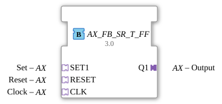

# AX_FB_SR_T_FF

* * * * * * * * * *
## Introduction
The function block **AX_FB_SR_T_FF** implements a bistable, set-dominant latch (SR flip-flop) combined with a toggle function. All communication takes place via adapter interfaces that bundle both event and data signals.
## Interface Structure
The block has no direct event or data inputs/outputs, but only adapters. These adapters each provide one event (`E1`) and one data value (`D1`) of type `BOOL`.

## **Event Inputs**
No direct event inputs. The following adapters provide the trigger mechanism via their event `E1`:

- **SET1** – Set event
- **RESET** – Reset event
- **CLK** – Clock event (for toggle)

### **Event Outputs**
No direct event outputs. The adapter **Q1** provides confirmation of the output change via its event `E1`.

### **Data Inputs**
The three input adapters each provide a data value `D1` (BOOL):

- **SET1.D1** – Set signal (active when TRUE)
- **RESET.D1** – Reset signal (active when TRUE)
- **CLK.D1** – Clock signal (rising edge triggers toggle)

### **Data Outputs**
The output adapter **Q1** outputs the current state of the latch as a BOOL value via **Q1.D1**.

### **Adapters**

| Adapter | Type | Direction | Description |

|---------|-----|-----------|--------------|

| `SET1` | `adapter::types::unidirectional::AX` | Socket (Input) | Set Input |

| `RESET` | `adapter::types::unidirectional::AX` | Socket (Input) | Reset Input |

| `CLK` | `adapter::types::unidirectional::AX` | Socket (Input) | Clock Input for Toggle |

| `Q1` | `adapter::types::unidirectional::AX` | Plug (Output) | Latch Output |

## Functionality
The function block operates according to the following priority-controlled algorithm:

1. **Set Dominance**: If `SET1.D1 = TRUE` is active, the output `Q1.D1` is set to `TRUE`.

2. **Reset**: Otherwise, if `RESET.D1 = TRUE` is active, `Q1.D1` is set to `FALSE`.

3. **Toggle**: If neither the set nor the reset operation is active, and a **rising edge** (transition from FALSE to TRUE) is detected at the clock input `CLK.D1`, the current output value is toggled (`Q1.D1 := NOT Q1.D1`).

The edge detection is performed by the internal variable `EDGE`: It stores the previous value of `CLK.D1`. The algorithm checks whether `CLK.D1 = TRUE` and `EDGE = FALSE` are active. After the calculation, `EDGE` is set to the current `CLK.D1`.

## Technical Features
- **Pure Adapter Interface**: The module does not use traditional event/data ports, but rather encapsulates the signals in adapters. This allows for flexible reuse and encapsulation of interfaces.
- **Set Dominant Behavior**: Simultaneous setting and resetting always results in the output being set.
- **Toggle with Upward Edge**: The toggle function reacts only to rising edges of the clock signal, not to static levels.
- **Single ECC State**: The ECC consists only of the state `REQ`. Each incoming event (`SET1.E1`, `RESET.E1`, or `CLK.E1`) immediately triggers the re-execution of the algorithm.

## State Overview
The function block has only one state:

- **REQ** – Waits for incoming events. The algorithm `REQ` is executed upon each event. All transitions return to `REQ`.

Internally, the variable `EDGE` is used for edge detection; it is part of the internal state but is not visible as an ECC state.

## Application Scenarios
- **Priority Control**: When a set pulse should always take precedence over a reset pulse, e.g., in safety circuits.
- **Combined Set/Reset and Toggle Function**: For applications where an output can be set/reset by external signals and also toggled by a push button (e.g., manual operation with priority).
- **Adapter-Based Systems**: In a modular environment where interfaces are standardized via adapters (e.g., AX adapter system).

## Comparison with Similar Function Blocks
- **SR Flip-Flop (Set-Dominant)** – pure set/reset function without toggle. This function block extends this by adding the toggle capability.
- **T Flip-Flop** – toggle only (no set/reset). AX_FB_SR_T_FF offers additional set and reset priority.
- **Reset-Dominant SR Flip-Flops** – resets in case of conflicts. This function block behaves in the opposite way.

## Conclusion

The **AX_FB_SR_T_FF** combines a set-dominant SR latch with an edge-triggered toggle function in a compact module. Its exclusive use of adapters makes it ideal for modular, adapter-based automation solutions. Clear prioritization and edge detection provide predictable and robust switching behavior.
