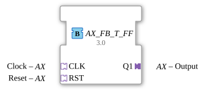

# AX_FB_T_FF

* * * * * * * * * *
## Introduction
The function block **AX_FB_T_FF** implements a clock-edge-triggered toggle flip-flop (T-FF).
It toggles its output state on each active clock edge and can be reset asynchronously.

Inputs and outputs are exclusively via adapters of type `AX`, which transmit both an event and a Boolean data value.

## Interface Structure

The function block has no direct event or data interfaces.

All communication takes place via **adapters** (plugs and sockets).

## **Event Inputs**

None (events are received via adapters `CLK` and `RST`).

### **Event Outputs**

None (Events are sent via adapter `Q1`).

### **Data Inputs**
None (Data is received via adapters `CLK` and `RST`).

### **Data Outputs**

None (Data is sent via adapter `Q1`).

### **Adapter**

| Direction | Name | Type | Description |

|----------|------|-----|--------------|

| **Socket** (Input) | `CLK` | `adapter::types::unidirectional::AX` | Clock signal – with each incoming event (E1), the Boolean value (D1) is evaluated as the clock level. |

| **Socket** (Input) | `RST` | `adapter::types::unidirectional::AX` | Reset – with an incoming event (E1), the output is set to FALSE, independent of the clock (asynchronous reset). |

| **Plug** (Output) | `Q1` | `adapter::types::unidirectional::AX` | Output – with each clock change or reset, an event (E1) is triggered and the current Boolean value (D1) is sent. |

The adapters of type `unidirectional::AX` contain internally:

- An event (E1)
- A data (D1) of type `BOOL`

## Functionality

The device operates as a **toggle flip-flop with positive edge detection**.

It has an internal memory `EDGE` that stores the last clock level.

**Algorithm (in REQ state):**

1. When a reset event arrives at `RST.E1`:

- Output `Q1.D1` is set to `FALSE`.
- Output event `Q1.E1` is triggered.

2. Otherwise, if a clock event arrives at `CLK.E1`:

- Check if the current clock level is `CLK.D1 = TRUE` and the previous level is `EDGE = FALSE` (i.e., a rising edge).
- If so: `Q1.D1` is inverted (`NOT Q1.D1`).
- Regardless of the edge, `EDGE := CLK.D1` is set (level marker).
- Output event `Q1.E1` is triggered.

3. If the output remains unchanged when `RST.E1` or `CLK.E1` does not arrive, no event is sent.

## Technical Features
- **Adapter-based interface**: The module uses adapters exclusively, which facilitates modular coupling with other modules of the same type.
- **Edge detection**: The internal variable `EDGE` implements simple positive edge detection. A key change from 0→1 triggers the toggling; a constant high level triggers only once.
- **Asynchronous reset**: The reset takes precedence over the clock edge – it immediately resets the output, even if a clock event is simultaneously occurring.
- **Only one ECC state**: The entire process takes place in the state `REQ`. Both transitions (`CLK.E1` and `RST.E1`) return to this state.

## State Overview

The ECC consists of a single state, `REQ`.

Each incoming event pulse (via `CLK.E1` or `RST.E1`) triggers the execution of the algorithm `REQ` and an immediate output event on `Q1.E1`.

| Current State | Incoming Event | Next State | Executed Action |

|-------------------|----------------------|------------------|--------------------|

| REQ | `RST.E1` | REQ | RESET: Q1.D1 = FALSE |

| REQ | `CLK.E1` | REQ | Toggle on rising edge and update EDGE |

No other states or dwell times.

## Application Scenarios
- **Clock-Controlled State Transition**: Switching an output on each rising edge of a clock signal (e.g., for frequency dividers or counters).
- **Key Debouncing**: Combined with a debouncing component, the flip-flop can generate a stable state transition with each key press.
- **Signal Switching**: Switching a signal on and off using repeated pulses.
- **Control in Automation Systems**: E.g., switching between two operating modes.

## Comparison with Similar Components
- **Standard T-FF (e.g., `F_TRIG`/`R_TRIG`)**: These components only detect edges but do not toggle the output. `AX_FB_T_FF` combines edge detection and toggle functionality.
- **SR Flip-Flop (Set/Reset)**: Unlike the SR flip-flop, the T flip-flop has only one reset input and toggles on every clock cycle instead of being controlled by separate set and reset signals.
- **Adapter-Based Variants**: Other T flip-flops in 4diac often use direct inputs/outputs. This component allows loose coupling via adapters, which increases reusability.

## Conclusion

The `AX_FB_T_FF` is a compact and flexible function block that implements a toggle flip-flop with positive edge detection and asynchronous reset.

Its pure adapter interface makes it particularly well-suited for modular, adapter-based designs where data and event transmission occur over a single channel.

Its simple logic and minimal state machine make it reliable and easy to understand.

---

### 🌐 Related topic subpages on ms-muc-docs.de
* [🌐 Eclipse 4diac IDE & Color Reference on ms-muc-docs.de](https://www.ms-muc-docs.de/iec-61499/eclipse-4diac/)

]
