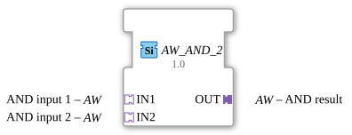

# AW_AND_2

* * * * * * * * * *

## Introduction

**AW_AND_2** is a generic function block for the bitwise AND operation across 2 input values of type `WORD` (16-bit bit pattern (word)). Unlike the Boolean operation on single truth values (as in the `AX_AND` blocks), every bit of the data word is combined independently here.

## Interface Structure

### **Event Inputs**

No event inputs available

### **Event Outputs**

No event outputs available

### **Data Inputs**

No direct data inputs available

### **Data Outputs**

No direct data outputs available

### **Adapters**

**Input Adapters:**

- **IN1**: AND input 1 (Type: adapter::types::unidirectional::AW)
- **IN2**: AND input 2 (Type: adapter::types::unidirectional::AW)

**Output Adapter:**

- **OUT**: AND result (Type: adapter::types::unidirectional::AW)

## Functionality

As soon as an event arrives at one of the 2 input adapters (`IN1` … `IN2`), the block combines the bit patterns of all 2 inputs bitwise using **AND** and writes the result to the output adapter `OUT`. The starting value of the operation is the identity element (all bits set (identity element of the AND operation)), so that with only one input actually connected, its value is passed through unchanged.

Only if the newly computed result differs from the value currently held on `OUT` is `OUT` rewritten and its adapter event sent (see "Change Detection" below).

## Technical Features

- **Generic function block**: The FB is defined as a generic type (`GEN_AW_AND`) and covers all arities (2 to 4 inputs) of the same underlying logic via the GenericClassName mechanism.
- **Bitwise operation**: Unlike the Boolean `AX_AND` blocks, every bit of the `WORD` data word is combined individually here, not just a single truth value.
- **Unidirectional adapters**: All adapters are of type `unidirectional::AW` – data flows only from the socket to the plug.
- **Standard compliance**: The block implements the operation according to IEC 61499-2 / IEC 61131-3.

## State Overview

Since this is a combinational logic block, AW_AND_2 has no internal states. The output is recalculated directly from the current input values on every incoming event.

## Application Scenarios

- **Bit mask combination**: Combining multiple status registers or flag bytes of type `WORD` into a single result.
- **Signal aggregation**: Merging multiple `WORD` data sources (e.g., from different modules) via a shared AND operation.
- **Diagnostics and status evaluation**: Checking bit patterns for commonly or differently set bits.

## ⚖️ Comparison with Similar Blocks

Unlike `AX_AND_2`, which combines individual Boolean truth values, `AW_AND_2` operates on the full bit pattern of a `WORD` value. Compared to the standard block [AND_2](../../../StandardLibraries/iec61131-3/bitwiseOperators/AND_2.md), `AW_AND_2` uses adapter-based interfaces instead of direct data/event inputs/outputs, enabling more flexible integration into adapter-based system architectures.

## Change Detection

The result is only written to the output plug (`OUT`) and its adapter event only sent if the newly computed value differs from the value currently held on `OUT`. If the result is unchanged, no adapter event is sent, avoiding redundant updates on downstream peers.

## Conclusion

**AW_AND_2** offers a reliable, generic implementation of the bitwise AND function for `WORD` values with adapter-based interfaces. Its generic nature makes it versatile for use in automation projects developed according to the IEC 61499 standard that need to combine multiple bit patterns of the same data type.
