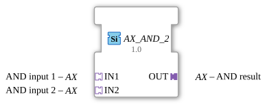

# AX_AND_2

* * * * * * * * * *
## Introduction

The AX_AND_2 is a generic function block for calculating the logical AND operation. The block processes two Boolean input signals and outputs the logical AND result.

## Interface Structure

### **Event Inputs**

No event inputs available

### **Event Outputs**

No event outputs available

### **Data Inputs**

No direct data inputs available

### **Data Outputs**

No direct data outputs available

### **Adapters**

**Input Adapter:**

- **IN1** - AND input 1 (Adapter type: adapter::types::unidirectional::AX)
- **IN2** - AND input 2 (Adapter type: adapter::types::unidirectional::AX)

**Output Adapter:**

- **OUT** - AND result (Adapter type: adapter::types::unidirectional::AX)

## Functionality

The function block performs a logical AND operation on the two input signals IN1 and IN2. The result is output via the output adapter OUT. Processing is unidirectional via the adapter interfaces.

## Technical Features

- Generic function block with the specific class name 'GEN_AX_AND'
- Uses unidirectional adapters for signal transmission
- Implemented according to the IEC 61499-2 standard

## State Overview

Since it is a combinational logic block, the AX_AND_2 has no internal states. The output is calculated directly from the current input values.

## Application Scenarios

- Safety-critical controllers where two conditions must be met simultaneously
- Linking sensor signals in industrial automation systems
- Logical operations in control systems
- Safety shutdowns with multiple conditions

## ⚖️ Comparison with Similar Blocks

Compared to standard AND blocks, the AX_AND_2 uses adapter-based interfaces instead of direct data and event inputs/outputs. This enables more flexible integration into adapter-based system architectures.

Comparison [AND_2](../../../StandardLibraries/iec61131-3/bitwiseOperators/AND_2.md)

## 🛠️ Related Exercises

- [Exercise_002a_AX](../../../../Uebungen/test_AX/Uebungen_doc/Uebung_002a_AX.md)
- [Exercise_002b3_AX](../../../../Uebungen/test_AX/Uebungen_doc/Uebung_002b3_AX.md)
- [Exercise_006a3_AX](../../../../Uebungen/test_AX/Uebungen_doc/Uebung_006a3_AX.md)

## Change Detection

The result is only written to the output plug (`OUT`) and its adapter event only sent if the newly computed value differs from the value currently held on `OUT`. If the result is unchanged, no adapter event is sent, avoiding redundant updates on downstream peers.

## Conclusion

The AX_AND_2 offers a reliable and standards-compliant implementation of the logical AND function with adapter-based interfaces. Its generic nature makes it versatile for use in various automation projects developed according to the IEC 61499 standard.
