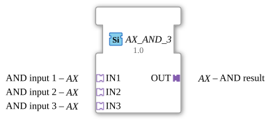

# AX_AND_3


* * * * * * * * * *

## Introduction
The AX_AND_3 is a generic function block for calculating a three-input logical AND operation. The block performs a Boolean AND operation on three independent input signals and outputs the result via an adapter output.




## Interface Structure

### **Event Inputs**
No event inputs available

### **Event Outputs**
No event outputs available

### **Data Inputs**
No direct data inputs available

### **Data Outputs**
No direct data outputs available

### **Adapters**

**Input Adapters (Sockets):**

- **IN1** - AND Input 1 (Type: adapter::types::unidirectional::AX)

- **IN2** - AND Input 2 (Type: adapter::types::unidirectional::AX)

- **IN3** - AND Input 3 (Type: adapter::types::unidirectional::AX)

**Output Adapters (Plugs):**

- **OUT** - AND Result (Type: adapter::types::unidirectional::AX)

## Functionality
The AX_AND_3 block performs a logical AND operation on the three input signals. The output signal is only active (TRUE) if all three input signals are active (TRUE) simultaneously. Processing is continuous based on the current input values.

## Technical Features
- Uses unidirectional adapters for signal transmission
- Implemented as a generic function block with the generic class 'GEN_AX_AND'
- Works with AX-type adapters for standardized signal transmission
- No event-driven control - continuous evaluation

## State Overview
The function block does not have an internal state machine, as it operates as a combinational logic circuit. The output is calculated directly from the current combination of input values.
...
``` ## Application Scenarios

- Safety controllers where multiple conditions must be met simultaneously
- Linking sensor signals in industrial controllers
- Logical processing in automation systems
- Monitoring systems with multiple conditions

## ⚖️ Comparison with similar function blocks
Compared to standard AND blocks, AX_AND_3 offers:

- Three inputs instead of the typical two inputs
- Adapter-based interface instead of direct data inputs/outputs
- Specific AX type compatibility
- Unidirectional signal transmission

Comparison with [AND_3](../../../StandardLibraries/iec61131-3/bitwiseOperators/AND_3.md)]

## 🛠️ Related Exercises

* [Exercise_002a6_AX](../../../../Uebungen/test_AX/Uebungen_doc/Uebung_002a6_AX.md)]

## Conclusion
The AX_AND_3 is a specialized logic function block for applications requiring triple AND operation with standardized AX adapters. Its adapter-based architecture enables easy integration into existing control systems and offers a reliable solution for complex logical connections.