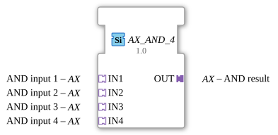

# AX_AND_4

* * * * * * * * * *
## Introduction

The AX_AND_4 function block is a generic function block for calculating a four-input logical AND operation. It is used to process Boolean signals in automation systems and allows the combination of multiple input signals into a single output signal.

## Interface Structure

### **Event Inputs**

No event inputs available

### **Event Outputs**

No event outputs available

### **Data Inputs**

No direct data inputs available

### **Data Outputs**

No direct data outputs available

### **Adapters**

**Plug Adapter:**

- **OUT**: AND result (Adapter type: adapter::types::unidirectional::AX)

**Socket Adapter:**

- **IN1**: AND input 1 (Adapter type: adapter::types::unidirectional::AX)
- **IN2**: AND input 2 (Adapter type: adapter::types::unidirectional::AX)
- **IN3**: AND input 3 (Adapter type: adapter::types::unidirectional::AX)
- **IN4**: AND input 4 (Adapter type: adapter::types::unidirectional::AX)

## Functionality

This function block performs a logical AND operation across four inputs. The output signal is only active (TRUE) if all four input signals are active (TRUE) simultaneously. As soon as at least one of the four inputs is inactive (FALSE), the output also becomes inactive.

## Technical Features

- Generic function block with predefined class name 'GEN_AX_AND'
- Uses unidirectional adapters for signal transmission
- Implemented as part of the "adapter::booleanOperators" package
- Supports four independent input signals

## State Overview

Since it is a combinational logic block, the AX_AND_4 has no internal states. The output is determined solely by the current input values.

## Application Scenarios

- Safety controllers where multiple conditions must be met simultaneously
- Monitoring of multiple sensors
- Linking enable signals in process controllers
- Logical linking of control commands

Comparison with [AND_4](../../../StandardLibraries/iec61131-3/bitwiseOperators/AND_4.md)]

## ⚖️ Comparison with similar function blocks

Compared to simple AND blocks with fewer inputs, AX_AND_4 offers the ability to directly link four signals without additional chaining. Compared to OR operations, the AND operation places stricter demands on activation.

## Conclusion

The AX_AND_4 function block provides an efficient solution for linking four Boolean input signals using a logical AND operation. Through the use of adapters, it enables flexible integration into various control systems and is particularly suitable for applications where multiple safety or enable conditions must be met simultaneously.