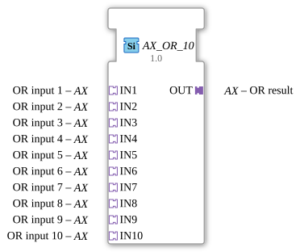

# AX_OR_10

* * * * * * * * * *
## Introduction

The AX_OR_10 is a generic function block for calculating the logical OR operation of 10 inputs.

## Interface Structure

### **Adapters**

**Input Adapters:**

- **IN1** to **IN10** (adapter::types::unidirectional::AX)

**Output Adapters:**

- **OUT** (adapter::types::unidirectional::AX)

## Functionality

The function block performs a logical OR operation on the 10 input signals.

## Technical Features

- Generic function block with the specific class name 'GEN_AX_OR'
- Uses unidirectional adapters.

## State Overview

Combinatory logic block without states.

## Application Scenarios

Logical logic gates with many inputs.

## ⚖️ Comparison with similar building blocks

- **AX_OR_2...9**: Variants with fewer inputs.

## Conclusion

Adapter-based OR gate with 10 inputs.