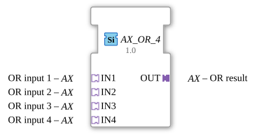

# AX_OR_4

* * * * * * * * * *

## Introduction
The AX_OR_4 is a generic function block for calculating a four-input logical OR operation. The block processes Boolean signals and outputs the result of the OR operation via an adapter output.

## Interface Structure

### **Event Inputs**
No event inputs available.

### **Event Outputs**
No event outputs available.

### **Data Inputs**
No direct data inputs available.

### **Data Outputs**
No direct data outputs available.

### **Adapters**

**Incoming Adapters (Sockets):**

- **IN1**: OR Input 1 (Type: adapter::types::unidirectional::AX)

- **IN2**: OR Input 2 (Type: adapter::types::unidirectional::AX)

- **IN3**: OR Input 3 (Type: adapter::types::unidirectional::AX)

- **IN4**: OR Input 4 (Type: adapter::types::unidirectional::AX)

**Outgoing Adapters (Plugs):**

- **OUT**: OR Result (Type: adapter::types::unidirectional::AX)

## Functionality
This function block continuously calculates the logical OR operation of the four input signals. The result is output via the outgoing adapter OUT. The OR operation returns a logical TRUE if at least one of the four inputs is TRUE. Only if all four inputs are FALSE will the result be FALSE.

## Technical Features
- Uses unidirectional adapters for communication
- Implemented as a generic function block with the class 'GEN_AX_OR'
- Works with the AX adapter type for Boolean values
- No event control - operates continuously

## State Overview
Since it is a combinational function block without event control, the AX_OR_4 does not have a state machine. The output is calculated continuously based on the current input values.

## Application Scenarios
- Safety circuits with multiple emergency stop buttons
- Monitoring systems with multiple sensors
- Control logic with parallel conditions
- Alarm systems with multiple triggers

## ⚖️ Comparison with Similar Function Blocks
Compared to simpler OR function blocks, the AX_OR_4 offers the advantage of four inputs in a single block, which simplifies wiring and saves space. Compared to event-driven function blocks, AX_OR_4 operates continuously without explicit trigger events.

Comparison with [OR_4](../../../StandardLibraries/iec61131-3/bitwiseOperators/OR_4.md)]

## Conclusion
The AX_OR_4 is an efficient and compact function block for four-input logical OR gates. Its adapter-based interface allows for flexible integration into larger control systems, while its continuous operation ensures an immediate response to input changes.