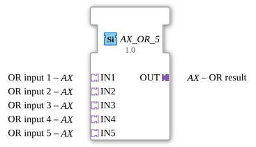

# AX_OR_5

* * * * * * * * * *
## Introduction
The AX_OR_5 function block is a generic block for calculating Boolean OR operations with five inputs. It is used for the logical processing of signals in automation systems and allows the combination of multiple input signals into a single output signal.

## Interface Structure

### **Event Inputs**
No event inputs available.

### **Event Outputs**
No event outputs available.

### **Data Inputs**
No direct data inputs available.

### **Data Outputs**
No direct data outputs available.

### **Adapters**
**Plug Adapter:**

- **OUT**: Unidirectional adapter for the OR result

**Socket Adapter:**

- **IN1**: Unidirectional adapter for OR input 1
- **IN2**: Unidirectional adapter for OR input 2
- **IN3**: Unidirectional adapter for OR input 3
- **IN4**: Unidirectional adapter for OR input 4
- **IN5**: Unidirectional adapter for OR input 5

## Functionality
This function block calculates the logical OR operation of the five input signals. The output signal is TRUE if at least one of the five inputs is TRUE. If all inputs are FALSE, the output signal is also FALSE. Processing is performed via adapter interfaces, with all inputs and outputs configured unidirectionally.

## Technical Features
- Generic function block with five inputs
- Uses unidirectional adapters for all interfaces
- Implemented as a five-operand OR gate
- No event-driven logic, continuous signal processing

## State Overview
The block has no internal state and operates stateless. The output is continuously calculated based on the current input values.

## Application Scenarios
- Safety circuits with multiple emergency stop buttons
- Monitoring systems with multiple sensors
- Control logic with parallel conditions
- Alarm systems with multiple triggers

## ⚖️ Comparison with Similar Blocks
Compared to standard OR blocks with fewer inputs, AX_OR_5 offers the ability to process five signals simultaneously, simplifying wiring and saving space. Compared to cascaded OR gates, this block provides an integrated solution.

Comparison with [OR_5](../../../StandardLibraries/iec61131-3/bitwiseOperators/OR_5.md)]

## Conclusion
The AX_OR_5 function block provides an efficient solution for five-input OR logic operations. Using adapters, it allows for flexible integration into various system architectures and is particularly suitable for applications requiring logical combinations of multiple signals.