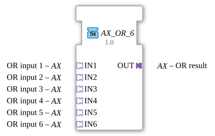

# AX_OR_6

* * * * * * * * * *
## Introduction
The AX_OR_6 is a generic function block for calculating a logical OR operation with six inputs. This block is used to process Boolean signals in automation systems and outputs the result of the OR operation via an adapter output.

## Interface Structure
### **Event Inputs**
No event inputs available

### **Event Outputs**
No event outputs available

### **Data Inputs**
No data inputs available

### **Data Outputs**
No data outputs available

### **Adapters**
**Input Adapters:**
- **IN1** - OR Input 1 (Type: adapter::types::unidirectional::AX)
- **IN2** - OR Input 2 (Type: adapter::types::unidirectional::AX)
- **IN3** - OR Input 3 (Type: adapter::types::unidirectional::AX)
- **IN4** - OR Input 4 (Type: adapter::types::unidirectional::AX)
- **IN5** - OR Input 5 (Type: adapter::types::unidirectional::AX)

- **IN6** - OR input 6 (Type: adapter::types::unidirectional::AX)

**Output adapter:**

- **OUT** - OR result (Type: adapter::types::unidirectional::AX)

## Functionality
The function block continuously calculates the logical OR operation of all six input signals. The output signal is TRUE if at least one of the six inputs is TRUE. Only if all six inputs are FALSE will the output also be FALSE.

## Technical Features
- Generic function block with the class 'GEN_AX_OR'
- Uses unidirectional AX adapters for signal transmission

- Six independent inputs for flexible applications

- Real-time processing without event control

## State Overview
The function block has no internal state and operates stateless. The output is continuously calculated based on the current input values.

## Application Scenarios

- Safety circuits with multiple emergency stop buttons
- Monitoring systems with multiple sensors
- Control logic with alternative activation conditions
- Linking multiple status messages

## ⚖️ Comparison with similar components

Compared to simpler OR components with fewer inputs, the AX_OR_6 offers greater flexibility thanks to its six separate inputs. The exclusive use of adapters instead of conventional data inputs/outputs enables a modular system architecture.

Comparison with [OR_6](../../../StandardLibraries/iec61131-3/bitwiseOperators/OR_6.md)]

## Conclusion
The AX_OR_6 is a specialized logic component for applications requiring a multi-input OR gate. Its adapter-based interface makes it particularly suitable for modular system designs and allows for clear separation of signal paths.