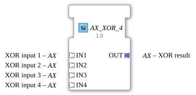

# AX_XOR_4

* * * * * * * * * *

## Introduction
The AX_XOR_4 function block is a generic function block for calculating the Boolean XOR operation with four inputs. It implements the exclusive OR operation for up to four different input signals.

## Interface Structure

### **Event Inputs**
*No event inputs available*

### **Event Outputs**
*No event outputs available*

### **Data Inputs**
*No direct data inputs available*

### **Data Outputs**
*No direct data outputs available*

### **Adapters**
**Plug Adapter:**
- **OUT**: Unidirectional adapter for the XOR result

**Socket Adapter:**
- **IN1**: Unidirectional adapter for XOR input 1
- **IN2**: Unidirectional adapter for XOR input 2
- **IN3**: Unidirectional adapter for XOR input 3
- **IN4**: Unidirectional adapter for XOR input 4

## Functionality
The function block calculates the XOR operation across four inputs. The XOR operation returns a "true" signal if and only if an odd number of inputs are active. With four inputs, this means:

- Result = 1 if 1 or 3 inputs are active

- Result = 0 if 0, 2, or 4 inputs are active

Communication occurs exclusively via the defined adapter interfaces.

## Technical Features
- Generic function block with the class 'GEN_AX_XOR'
- Uses unidirectional adapters for all inputs and outputs
- No direct event or data interfaces
- Fully adapter-based architecture

## State Overview
Since it is a combinational logic block, the AX_XOR_4 has no internal states. The output is determined solely by the current input values.

## Application Scenarios
- Parity check in control systems
- Odd parity check
- Safety-critical circuits with multiple inputs
- Distributed logic operations in automation systems

## ⚖️ Comparison with similar function blocks
Compared to standard XOR function blocks, AX_XOR_4 offers:

- Four inputs instead of the typical two inputs
- A purely adapter-based interface
- Specialization for unidirectional AX adapters
- No event-driven control, but continuous operation

Comparison with [XOR_4](../../../StandardLibraries/iec61131-3/bitwiseOperators/XOR_4.md)]

## Conclusion
The AX_XOR_4 function block represents a specialized solution for four-input XOR operations in adapter-based system architectures. Its purely adapter-based interface makes it particularly suitable for modular system designs where communication takes place via standardized adapters.