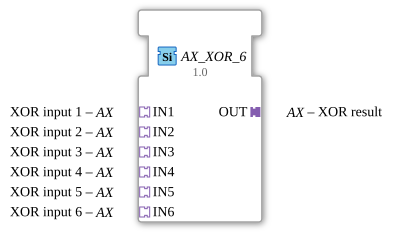

# AX_XOR_6

* * * * * * * * * *

## Introduction
The AX_XOR_6 is a generic function block for calculating the Boolean XOR operation with six inputs. The block implements the exclusive OR operation for up to six binary input signals and outputs the result via an adapter output.

## Interface Structure

### **Event Inputs**
No event inputs available.

### **Event Outputs**
No event outputs available.

### **Data Inputs**
No direct data inputs available.

### **Data Outputs**
No direct data outputs available.

### **Adapters**

**Plug Adapter:**

- **OUT** (Type: adapter::types::unidirectional::AX) - XOR result

**Socket Adapter:**

- **IN1** (Type: adapter::types::unidirectional::AX) - XOR input 1

- **IN2** (Type: adapter::types::unidirectional::AX) - XOR input 2

- **IN3** (Type: adapter::types::unidirectional::AX) - XOR input 3

- **IN4** (Type: adapter::types::unidirectional::AX) - XOR input 4

- **IN5** (Type: adapter::types::unidirectional::AX) - XOR input 5

- **IN6** (Type: adapter::types::unidirectional::AX) - XOR input 6

## Functionality
The function block calculates the XOR operation of all six inputs. The XOR operation returns a "TRUE" signal if and only if an odd number of inputs are set to "TRUE". An even number of "TRUE" inputs returns "FALSE".

## Technical Features

- Generic function block with the generic class 'GEN_AX_XOR'
- Uses unidirectional AX adapters for communication
- No event control - operates continuously based on the input values
- Supports six independent inputs for complex XOR calculations

## State Overview
Since this is a purely combinational function block without event control, the AX_XOR_6 has no internal states. The output is determined solely by the current input values.

## Application Scenarios

- Parity checking in data transmission systems
- Safety-critical controllers with multiple redundancy
- Error detection in binary signal chains
- Encryption algorithms with XOR operations
- Control systems with multi-input logic

## ⚖️ Comparison with similar function blocks

Compared to standard XOR function blocks with fewer inputs, the AX_XOR_6 offers the ability to process up to six signals simultaneously. While simple XOR blocks typically only have two inputs, this function block enables more complex logical operations without the need for additional nesting of multiple blocks.

Comparison with [XOR_6](../../../StandardLibraries/iec61131-3/bitwiseOperators/XOR_6.md)]

## Conclusion
The AX_XOR_6 is a specialized function block for demanding multi-input XOR operations. Its adapter-based interface allows for easy integration into existing control systems and provides an efficient solution for complex Boolean operations without additional wiring complexity.