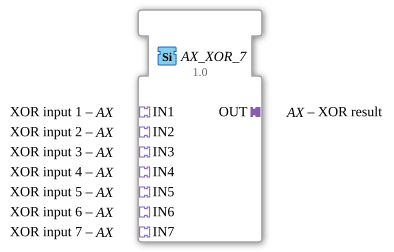

# AX_XOR_7

* * * * * * * * * *
## Introduction
The AX_XOR_7 function block is a generic function block for calculating the Boolean XOR operation with seven inputs. It allows the processing of up to seven input signals and outputs the result of the XOR operation.


## Interface Structure

### **Event Inputs**
No event inputs available.

### **Event Outputs**
No event outputs available.

### **Data Inputs**
No direct data inputs available.

### **Data Outputs**
No direct data outputs available.

### **Adapters**
**Plug Adapter:**

- `OUT` - XOR result (Adapter type: `adapter::types::unidirectional::AX`)

**Socket Adapter:**

- `IN1` - XOR input 1 (Adapter type: `adapter::types::unidirectional::AX`)
- `IN2` - XOR input 2 (Adapter type: `adapter::types::unidirectional::AX`)
- `IN3` - XOR input 3 (Adapter type: `adapter::types::unidirectional::AX`)
- `IN4` - XOR input 4 (Adapter type: `adapter::types::unidirectional::AX`)
- `IN5` - XOR input 5 (Adapter type: `adapter::types::unidirectional::AX`)
- `IN6` - XOR input 6 (Adapter type: `adapter::types::unidirectional::AX`)
- `IN7` - XOR input 7 (Adapter type: `adapter::types::unidirectional::AX`)

## Functionality
This function block performs the XOR operation across all seven inputs. The XOR operation returns a "TRUE" signal if and only if an odd number of inputs are set to "TRUE". An even number of "TRUE" inputs results in a "FALSE" output.

``` ## Technical Features
- Generic function block with the generic class name `GEN_AX_XOR`
- Uses unidirectional AX adapters for inputs and outputs
- Supports exactly seven inputs for XOR calculations
- Implemented as an adapter-based solution without direct event or data interfaces

## State Overview
The function block has no internal state and operates stateless. The output is calculated solely based on the current input values.

## Application Scenarios
- Parity checking in data transmission systems
- Safety-critical controllers with majority voting
- Error detection in binary signal chains
- Logical operations in industrial automation systems

## ⚖️ Comparison with Similar Function Blocks
Compared to standard XOR blocks with fewer inputs, AX_XOR_7 offers the ability to perform XOR operations with up to seven inputs. While simple XOR blocks typically process only two inputs, this function block enables more complex logic operations within a single block.

Comparison with [XOR_7](../../../StandardLibraries/iec61131-3/bitwiseOperators/XOR_7.md)]

## Conclusion
The AX_XOR_7 function block provides an efficient solution for multi-input XOR operations. Its adapter-based architecture allows for flexible integration into various control systems and makes it particularly suitable for applications requiring odd parity checks across multiple signals.