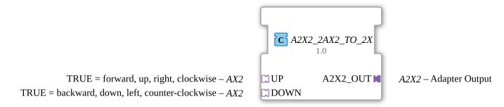

# A2X2_2AX2_TO_2X

* * * * * * * * * *

## Introduction

The A2X2_2AX2_TO_2X function block composes an [A2X2](../../../types/bidirectional/BOOL/A2X2.md) plug from two [AX2](../../../types/bidirectional/BOOL/AX2.md) sockets — one for the UP channel, one for the DOWN channel. Since AX2 is itself already bidirectional (1 event/1 bool per direction), a single AX2 per channel is enough to cover both directions of A2X2.

## Interface Structure

### **Event Inputs**

The function block has no direct event inputs — communication happens exclusively through the adapters.

### **Event Outputs**

The function block has no direct event outputs.

### **Data Inputs**

The function block has no direct data inputs.

### **Data Outputs**

The function block has no direct data outputs.

### **Adapters**

- **A2X2_OUT** (Plug): composed output of type `adapter::types::bidirectional::A2X2`
- **UP** (Socket): UP channel, of type `adapter::types::bidirectional::AX2` — TRUE = forward, up, right, clockwise
- **DOWN** (Socket): DOWN channel, of type `adapter::types::bidirectional::AX2` — TRUE = backward, down, left, counter-clockwise

## Functionality

For each channel, the full bidirectional wiring between A2X2 and the corresponding AX2 socket is established: whatever `A2X2_OUT` receives on its request side (`EI_UP`/`DI_UP`) is forwarded to `UP.EI1`/`UP.DI1`; whatever `UP` delivers on its indication side (`EO1`/`DO1`) appears on `A2X2_OUT.EO_UP`/`DO_UP`. The same wiring applies to DOWN via the `DOWN` socket. Both channels are fully independent.

## Technical Details

- Directly exploits AX2's bidirectionality — each channel needs only a single adapter, not two
- Pure wiring, no logic or state
- Every destination variable has exactly one writer, no fan-in on data connections

## State Overview

The block is stateless:

- A2X2_OUT.EI_UP → UP.EI1, A2X2_OUT.DI_UP → UP.DI1
- UP.EO1 → A2X2_OUT.EO_UP, UP.DO1 → A2X2_OUT.DO_UP
- A2X2_OUT.EI_DOWN → DOWN.EI1, A2X2_OUT.DI_DOWN → DOWN.DI1
- DOWN.EO1 → A2X2_OUT.EO_DOWN, DOWN.DO1 → A2X2_OUT.DO_DOWN

## Application Scenarios

- Building an A2X2 endpoint from two already existing, independent AX2 channels
- Systems where UP and DOWN are historically wired separately as AX2 but should present themselves as a single A2X2 externally
- Modular composition of larger adapters from smaller, reusable blocks

## ⚖️ Comparison with Similar Blocks

The counterpart [A2X2_2X_TO_2AX2](A2X2_2X_TO_2AX2.md) decomposes instead of composing. For the same task, [A2X2_4AX_TO_2X](A2X2_4AX_TO_2X.md) offers an alternative that uses four unidirectional [AX](../../../types/unidirectional/BOOL/AX.md) adapters instead of two bidirectional AX2 (two per channel, one per direction) — useful when only unidirectional AX infrastructure is available. The unidirectional predecessor [A2X_2AX_TO_2X](../../unidirectional/BOOL/A2X_2AX_TO_2X.md) composes analogously from two plain [AX](../../../types/unidirectional/BOOL/AX.md) adapters.

## Conclusion

A2X2_2AX2_TO_2X is the most efficient way to build an A2X2 from two existing AX2 channels, since both adapters are already bidirectional and no extra logic is needed.
