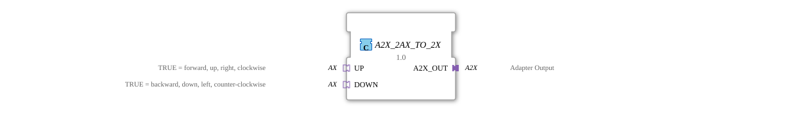

# A2X_2AX_TO_2X

* * * * * * * * * *
## Introduction
The A2X_2AX_TO_2X is a composite function block used to convert two AX signals into one A2X signal. This block allows the combination of two unidirectional AX adapter signals into a single A2X adapter output.

## Interface Structure

### **Event Inputs**
No direct event inputs available

### **Event Outputs**
No direct event outputs available

### **Data Inputs**
No direct data inputs available

### **Data Outputs**
No direct data outputs available

### **Adapters**
**Sockets (Inputs):**
- **UP**: AX adapter for positive direction of movement (TRUE = forward, up, right, clockwise)
- **DOWN**: AX adapter for negative direction of movement (TRUE = backward, down, left, counterclockwise)

**Plugs (Outputs):**

- **A2X_OUT**: A2X adapter output for the combined signals

## Functionality
The composite function block connects the two AX adapter inputs (UP and DOWN) directly to the A2X adapter output. Both event and data signals are forwarded:

- UP events and data are forwarded to E_UP and UP of the A2X_OUT adapter.
- DOWN events and data are forwarded to E_DOWN and DOWN of the A2X_OUT adapter.

## Technical Features
- Implemented as a composite function block without internal logic
- Direct signal pass-through without delay
- Uses unidirectional adapter types
- No state or internal processing

## State Overview
The function block has no internal states, as it is a pure pass-through function.

## Application Scenarios
- Combining two separate motion control signals
- Converting AX-based control systems to A2X interfaces
- Integration into larger control systems with A2X interface requirements
- Bidirectional motion sensing in automation systems

## ⚖️ Comparison with similar components

Compared to simple AX adapters, this component enables the combination of two opposing motion directions into a single A2X signal. It eliminates the need for manual wiring of two AX adapters to create one A2X adapter.

## Conclusion
The A2X_2AX_TO_2X is a simple yet effective composite function block that simplifies the integration of AX-based control components into systems with A2X interfaces. Direct signal forwarding without additional processing ensures reliable and lossless signal transmission.