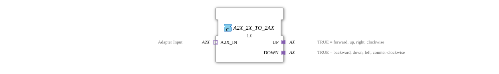

# A2X_2X_TO_2AX

* * * * * * * * * *
## Introduction
The A2X_2X_TO_2AX is a composite function block used to convert A2X signals into two separate AX signals. This block enables the conversion of bidirectional control signals into unidirectional motion commands.

## Interface Structure

### **Event Inputs**
- No direct event inputs available

### **Event Outputs**
- No direct event outputs available

### **Data Inputs**
- No direct data inputs available

### **Data Outputs**
- No direct data outputs available

### **Adapters**

**Input Adapters:**

- `A2X_IN` (Socket) - Adapter input of type `adapter::types::unidirectional::A2X`

**Output Adapters:**

- `UP` (Plug) - Output for positive movement direction (TRUE = forward, up, right, clockwise)
- `DOWN` (Plug) - Output for negative movement direction (TRUE (backwards, down, left, counterclockwise)

## Functionality
The composite function block forwards events and data directly from the A2X_IN adapter to the corresponding UP and DOWN output adapters:

- The E_UP event is forwarded to UP.E1
- The E_DOWN event is forwarded to DOWN.E1
- The UP data is forwarded to UP.D1
- The DOWN data is forwarded to DOWN.D1

## Technical Features
- Implemented as a composite function block without internal logic
- Direct signal forwarding without delay
- Uses unidirectional adapter types for clear signal flow

## State Overview
The function block has no internal state and operates stateless. All input signals are immediately forwarded to the corresponding outputs.

## Application Scenarios
- Conversion of bidirectional drive signals into separate forward/reverse controls
- Control of actuators with separate extension and retraction commands
- Integration into control systems with different signal formats
- Speed control with separate clockwise/counterclockwise controls

## ⚖️ Comparison with similar function blocks

Compared to simple converter function blocks, this composite function block offers a structured solution for splitting bidirectional signals into two independent unidirectional channels. The use of standardized adapter types ensures compatibility within the adapter framework.

## Conclusion
The A2X_2X_TO_2AX function block represents an efficient and standards-compliant solution for signal conversion. Its simple, direct routing logic and the use of established adapter types make it ideal for integration into more complex control systems that require the separation of motion directions.