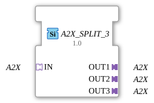

# A2X_SPLIT_3

* * * * * * * * * *

## Introduction

The function block **A2X_SPLIT_3** is used to split an incoming A2X adapter data stream into three identical outputs. It is implemented as a generic function block (FB) and is suitable for applications where a signal is required multiple times.

## Interface Structure

### **Event Inputs**

No event inputs available.

### **Event Outputs**

No event outputs available.

### **Data Inputs**

No data inputs available.

### **Data Outputs**

No data outputs available.

### **Adapter**

| Type | Name | Direction | Description |

|-----|------|----------|--------------|

| `adapter::types::unidirectional::A2X` | **IN** | Socket (Input) | Source adapter whose data stream is split. |

| `adapter::types::unidirectional::A2X` | **OUT1** | Plug (Output) | First identical output. |

| `adapter::types::unidirectional::A2X` | **OUT2** | Plug (Output) | Second identical output. |

| `adapter::types::unidirectional::A2X` | **OUT3** | Plug (Output) | Third identical output. |

The adapters are all of type **A2X** (unidirectional) and transmit data in one direction. The device is passive, meaning it does not require event control for data transmission.

## Functionality

The function block receives the A2X data stream arriving via socket **IN** and forwards it unchanged to the three plugs **OUT1**, **OUT2**, and **OUT3**. No processing, filtering, or buffering takes place – the data stream is distributed 1:1 to all outputs.

Since this is a generic function block, the specific data type of the A2X adapter can be defined at runtime by typing (e.g., via the attribute `GenericClassName`).

## Technical Features

- **Generic Design**: The function block is declared as a generic FB (`GenericClassName = 'GEN_A2X_SPLIT'`), allowing the A2X adapter to be parameterized with different specific data structures depending on the application.

- **No State Automation**: The function block does not have an ECC (Execution Control Chart) or event interfaces. It operates purely in a data flow-oriented manner.

- **Runtime Type Adaptation**: A unique type identifier for the generic instance can be stored via the attribute `TypeHash` (currently empty; must be set project-specifically).

## State Overview

The function block has no internal states, as it contains no sequential logic or state machine. Data transmission occurs continuously without delay.

## Application Scenarios

- **Signal Distribution**: An A2X signal from a sensor or controller must be forwarded in parallel to several downstream function blocks (e.g., displays, loggers, actuators).

- **Redundancy / Monitoring**: A data stream should be sent to both the actual processing unit and a diagnostic or monitoring system.

- **Prototypical Setups**: During the development phase, a single generic splitter can be flexibly used for various adapter types.

## Comparison with Similar Function Blocks

- **A2X_SPLIT_2**: Splits an A2X stream across two outputs. This function block extends this to three outputs.

- **Manual Duplication**: Without a splitter, the architect would have to reference the source adapter multiple times in the configuration, which reduces readability and maintainability.

- **Generic Splitters**: Other splitting function blocks (e.g., for data or event adapters) follow the same principle but are specialized for different adapter types.

## Conclusion

The **A2X_SPLIT_3** is a simple yet useful generic function block for duplicating an A2X data stream across three paths. Its generic nature allows it to adapt flexibly to different data structures and facilitates modular interconnection in IEC 61499-based automation systems.