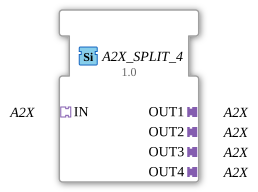

# A2X_SPLIT_4

* * * * * * * * * *
## Introduction

The function block **A2X_SPLIT_4** is used to split an incoming A2X adapter signal into four identical A2X outputs. It is designed as a generic block, enabling flexible use in a wide variety of automation environments where an A2X signal is required multiple times.
## Interface Structure

### **Event Inputs**

None.

### **Event Outputs**

None.

### **Data Inputs**

None.

### **Data Outputs**

None.

### **Adapter**

| Direction | Identifier | Type | Description |
|----------|------------|-----|--------------|
| **Socket (Input)** | IN | `adapter::types::unidirectional::A2X` | One incoming A2X signal (unidirectional) |
| **Plug (Output 1)** | OUT1 | `adapter::types::unidirectional::A2X` | First outgoing A2X channel |
| **Plug (Output 2)** | OUT2 | `adapter::types::unidirectional::A2X` | Second outgoing A2X channel |
| **Plug (Output 3)** | OUT3 | `adapter::types::unidirectional::A2X` | Third outgoing A2X channel |
| **Plug (Output 4)** | OUT4 | `adapter::types::unidirectional::A2X` | Fourth Outgoing A2X Channel |

## Functionality

This function block operates as a pure signal distributor. The A2X adapter interface connected to socket **IN** is internally routed to the four output plugs **OUT1** to **OUT4** without any further processing or delay. Each output delivers exactly the same signal as the input. Since these are unidirectional adapters, there is no feedback from the outputs to the input.

## Technical Features

- **Generic Function Block** – The function block is instantiated as `GEN_A2X_SPLIT` and can be adapted to different A2X variants using type parameters.
- **No Event or Data Processing** – The entire functionality is limited to forwarding the adapter signal. There are no events or data inputs/outputs.
- **Licensing** – This function block is licensed under the Eclipse Public License 2.0 (EPL-2.0).

## State Overview

This function block has no state machines (ECCs) and no internal behavior that is time- or state-dependent. The output signals follow the input signal immediately.

## Application Scenarios

- **Distribution of an A2X signal** to multiple downstream function blocks that rely on the same A2X information.
- **Star topologies** in communication between components of a distributed control system.
- **Test and simulation environments** where an A2X signal needs to be recorded or analyzed in parallel.

## Comparison with Similar Function Blocks

- **A2X_SPLIT_2** / **A2X_SPLIT_3** / **A2X_SPLIT_N** – These function blocks offer the same functionality with a different number of outputs.

**A2X_SPLIT_N** Unlike a **multiplexer** or **demultiplexer**, no selection takes place here – the signal is always duplicated to all outputs.

## Conclusion

The **A2X_SPLIT_4** is a simple yet useful component for duplicating a unidirectional A2X adapter signal. Its generic design and clear interface make it easy to integrate into existing 4diac IDE projects and contribute to the modularization of control applications.

---

### 🌐 Related topic subpages on ms-muc-docs.de

* [🌐 Eclipse 4diac IDE & Color Reference on ms-muc-docs.de](https://www.ms-muc-docs.de/iec-61499/eclipse-4diac/)

]
