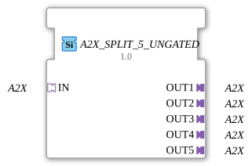

# A2X_SPLIT_5_UNGATED

> ℹ️ **UNGATED variant:** This block is the ungated version of [`A2X_SPLIT_5`](A2X_SPLIT_5.md). It suppresses **no** unchanged repeats – every newly computed result is forwarded unconditionally, even without a value change. This matters for consumers that need a periodic cadence regardless of value change (e.g. derivative/frequency calculations that would otherwise fail to decay toward zero). Any change-detection/gating statements further down this page do **not** apply to this block.

* * * * * * * * * *

## Introduction

The function block **A2X_SPLIT_5_UNGATED** is used to split an incoming A2X adapter into five identical A2X outputs. It is provided as a generic block that can be configured via attributes.

## Interface Structure

### **Event Inputs**

No event inputs available.

### **Event Outputs**

No event outputs available.

### **Data Inputs**

No data inputs available.

### **Data Outputs**

No data outputs available.

### **Adapter**

| Direction | Name | Type | Description |
| ---------- | ------ | ---------------- | -------------------------------------- |
| Socket | IN | A2X (unidirectional) | Input adapter (split) |
| Plug | OUT1 | A2X (unidirectional) | First output adapter |
| Plug | OUT2 | A2X (unidirectional) | Second output adapter |
| Plug | OUT3 | A2X (unidirectional) | Third output adapter |
| Plug | OUT4 | A2X (unidirectional) | Fourth output adapter |
| Plug | OUT5 | A2X (unidirectional) | Fifth output adapter |

## Functionality

The module forwards the A2X adapter input at socket `IN` unchanged and in parallel to all five plugs (`OUT1` to `OUT5`). There is no delay or buffering – any change at the input is immediately propagated to all outputs. Thus, the module behaves like a simple splitter for A2X interfaces.

## Technical Features

- **Generic Module:** The actual instance can be configured via the attributes `eclipse4diac::core::GenericClassName` and `eclipse4diac::core::TypeHash`, allowing adaptation to various A2X variants.
- **No Event or Data Ports:** All communication takes place exclusively via adapters. This simplifies integration with other A2X-based components.
- **Scalability:** The module can serve as the basis for splitters with a different number of outputs (e.g., `A2X_SPLIT_2`, `A2X_SPLIT_10`).

## State Overview

The module has no internal states or state machines. It operates purely combinatorially as a passive forwarder.

## Application Scenarios

- **Distributing a Bus Signal:** When an A2X adapter (e.g., for a fieldbus) needs to be transmitted to multiple downstream modules without interfering with each other.
- **Test and Simulation Setups:** An incoming A2X data stream can be routed in parallel to various analysis or monitoring components.
- **Expanding Control Systems:** A sensor or actuator adapter can be split across multiple function blocks that implement different logic.

## Comparison with Similar Function Blocks

- **A2X_SPLIT_2 / A2X_SPLIT_N:** These variants differ only in the number of outputs. `A2X_SPLIT_5_UNGATED` offers a fixed 5-way split.
- **A2X_MERGE:** While the splitter distributes one input to multiple outputs, the merge function block combines multiple A2X inputs into a single output.
- **Data splitters (e.g., SPLIT_INT):** These operate at the data level (e.g., integers) and not at the adapter level. The function block described here operates at the adapter level, which enables structural decoupling.

## Conclusion

The `A2X_SPLIT_5_UNGATED` is a simple yet useful adapter splitter for A2X interfaces. Due to its generic nature and pure adapter communication, it integrates seamlessly into IEC 61499-based control systems. It is particularly suitable for applications where an A2X signal needs to be distributed across multiple paths without requiring additional logic or states.

---

### 🌐 Related topic subpages on ms-muc-docs.de

- [🌐 Eclipse 4diac IDE & color reference on ms-muc-docs.de ](https://www.ms-muc-docs.de/iec-61499/eclipse-4diac/)

]
