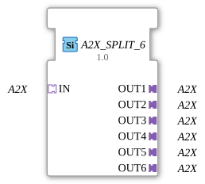

# A2X_SPLIT_6

* * * * * * * * * *
## Introduction

The function block `A2X_SPLIT_6` is used to distribute an incoming A2X adapter to six identical A2X outputs. It is implemented as a generic function block (GFB) and enables the forwarding of adapter data without delay or state change. Typical applications include the parallel power supply of multiple devices or signal cascading in industrial control systems.
## Interface Structure

### **Event Inputs**

None.

### **Event Outputs**

None.

### **Data Inputs**

None.

### **Data Outputs**

None.

### **Adapter**

| Direction | Name | Type | Description |
|----------|-----|-----|--------------|
| Input (Socket) | `IN` | `adapter::types::unidirectional::A2X` | Receives the incoming A2X adapter signal |
| Output (Plug) 1 | `OUT1` | `adapter::types::unidirectional::A2X` | First outgoing A2X adapter |
| Output (Plug) 2 | `OUT2` | `adapter::types::unidirectional::A2X` | Second outgoing A2X adapter |
| Output (Plug) 3 | `OUT3` | `adapter::types::unidirectional::A2X` | Third outgoing A2X adapter |
| Output (Plug) 4 | `OUT4` | `adapter::types::unidirectional::A2X` | Fourth outgoing A2X adapter |
| Output (Plug) 5 | `OUT5` | `adapter::types::unidirectional::A2X` | Fifth outgoing A2X adapter |
| Output (Plug) 6 | `OUT6` | `adapter::types::unidirectional::A2X` | Sixth outgoing A2X adapter |

## Functionality

The module functions as a simple distributor (splitter). As soon as socket `IN` is connected to an A2X adapter, the complete adapter signal—consisting of all data and event channels contained within this adapter—is passed on to all six plugs (`OUT1` … `OUT6`). This transmission occurs without buffering or internal logic; any change at the input is reflected instantly at all outputs.

## Technical Features

- **Unidirectionality** – The adapter `A2X` is designed to be unidirectional; data flow reversal is not supported.
- **Generic Design** – The function block (FB) is stored as a generic type (`GenericClassName = 'GEN_A2X_SPLIT'`), allowing it to be used in various contexts.
- **No States or Events** – There are no internal state machines or event-driven processes; The function block (FB) is purely combinational.
- **Complete Decoupling** – The use of adapters decouples the connected blocks, increasing reusability.

## State Overview

The function block does not have its own state machine. It is always passive and only active via the adapter data present at its input. Therefore, there are no defined states such as INIT, RUN, or IDLE.

## Application Scenarios

- **Signal Distribution in Automation** – A sensor delivers measured values via an A2X adapter, which must be forwarded in parallel to multiple controllers or evaluation units.
- **Cascading of Adapter Signals** – In complex hierarchies, an A2X signal can be distributed across multiple subordinate modules.
- **Test and Simulation Environments** – For simultaneously connecting multiple test benches or visualization components to a single data source.

## Comparison with Similar Function Blocks

- **A2X_SPLIT_2 / A2X_SPLIT_4 / A2X_SPLIT_N** – These function blocks offer the same functionality, but with two, four, or a configurable number of outputs. `A2X_SPLIT_6` provides a fixed 6-way distribution.
- **A2X_MERGE** – Unlike the splitter, this function block combines multiple A2X inputs into a single output.
- **Standard Data Splitters** (e.g., for simple data types) – Adapter-based splitters like this one operate at a higher level of abstraction and encapsulate complex signal bundles.

## Conclusion

The `A2X_SPLIT_6` is a simple yet useful function block for multiplying A2X adapter signals. Its generic structure and pure distribution function make it particularly suitable for scenarios where a signal needs to be sent to multiple receivers without any processing logic. The absence of events and states makes it easy to understand and resource-efficient to use.
