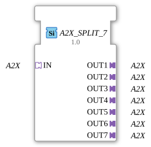

# A2X_SPLIT_7

* * * * * * * * * *
## Introduction

The function block **A2X_SPLIT_7** is used to distribute an incoming A2X adapter signal to seven identical outputs. It is provided as a generic FB and enables efficient signal multiplication within 4diac IDE projects.

## Interface Structure

### **Event Inputs**
- None

### **Event Outputs**
- None

### **Data Inputs**
- None

### **Data Outputs**
- None

### **Adapter**

| Type | Name | Description |

|-----|------|---------------|

| A2X (Socket) | **IN** | Input adapter for the A2X signal to be distributed |

A2X (Plug) | **OUT1** … **OUT7** | Seven output adapters, each providing an identical copy of the input signal |

## Functionality

The function block forwards the A2X signal present at the **IN** adapter unchanged to all seven output adapters (**OUT1** to **OUT7**). No data manipulation takes place – the signals are simply passively duplicated. The function block is purely adapter-based and requires neither event nor data inputs.

## Technical Features

- **Generic Function Block**: The function block is declared as a generic type (`GEN_A2X_SPLIT`) and can be reused in various contexts.

- **Unidirectional Adapters**: All A2X adapters used are of type `unidirectional`, meaning data flows in only one direction (from the socket to the plug).

- **No Event Control**: Signal transmission is purely data flow-driven without additional events or states.

- **Easily Extensible**: Any number of outputs (e.g., 2, 4, 10) can be implemented by modifying the XML definition.

## State Overview

The function block (FB) does not have its own state machine (ECC). The output signals are always an exact representation of the input signal. There are no internal states or time delays.

## Application Scenarios

- **Distributing a sensor or control signal** to multiple parallel function blocks or subsystems.

- **Providing identical adapter data** for redundant processing paths (e.g., backups).

- **Simulation or test setups** where a signal is needed multiple times without instantiating the source multiple times.

## Comparison with similar function blocks

- **A2X_SPLIT_2, A2X_SPLIT_3, …**: These function blocks distribute the input signal to two, three, or more outputs. This function block is specifically designed for seven outputs and can be considered a specialization of a generic split function block.

- **Manual multiplication via connection**: Theoretically, an A2X signal could also be distributed by connecting an output multiple times – however, the split function block provides a clean, structured, and reusable solution.

## Conclusion

The **A2X_SPLIT_7** is a simple yet useful function block for signal multiplication in A2X-based adapter systems. Its generic nature and clear interface make it ideally suited for modular automation solutions using the 4diac IDE.

---

### 🌐 Related topic subpages on ms-muc-docs.de

* [🌐 Eclipse 4diac IDE & Color Reference on ms-muc-docs.de](https://www.ms-muc-docs.de/iec-61499/eclipse-4diac/)

]