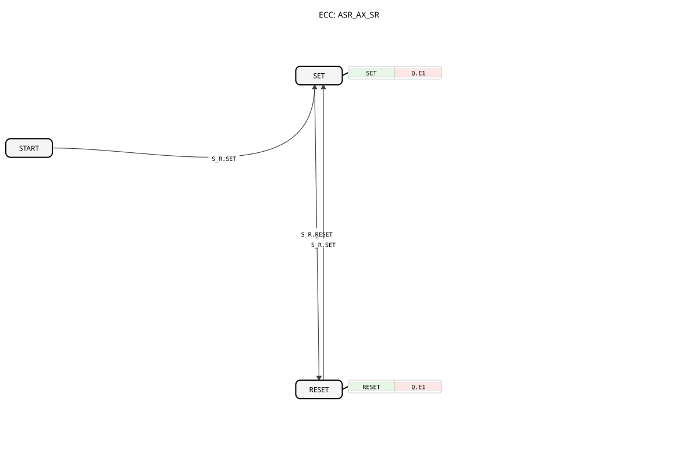

# ASR_AX_SR

* * * * * * * * * *
## Introduction
The ASR_AX_SR is an event-driven bistable function block (flip-flop) that operates according to the set-reset principle. It is used to store a binary state and is controlled via adapter interfaces.

## Interface Structure
### **Event Inputs**
No direct event inputs are available – control is exclusively via adapters.

### **Event Outputs**
No direct event outputs are available – output is exclusively via adapters.

### **Data Inputs**
No direct data inputs are available.

### **Data Outputs**
No direct data outputs are available.

### **Adapters**
- **S_R (Socket)**: Set/Reset control adapter of type `adapter::types::unidirectional::ASR`
- **Q (Plug)**: Output adapter of type `adapter::types::unidirectional::AX` for the flip-flop state

## Functionality
The ASR_AX_SR operates as a set/reset flip-flop with three states:

- **START**: Initial state
- **SET**: Set state (Q = TRUE)
- **RESET**: Reset state (Q = FALSE)

Upon a SET event via the S_R adapter, the block switches to the SET state and sets the output Q to TRUE. Upon a RESET event, it switches to the RESET state and sets Q to FALSE.

## Technical Features
- **No Prioritization (Dominance)**: Since setting and resetting are triggered by separate events (`S_R.SET`, `S_R.RESET`), there is no simultaneous dominance as in IEC 61131-3. The state is determined by the last event received ("Last Event Wins").
- **Use of Adapters**: Uses unidirectional adapters for input and output (`ASR` for set/reset, `AX` for output).
- **Implementation**: Implemented as a Basic Function Block with an explicit state machine (ECC).
- **Interface**: No direct inputs/outputs; communication is exclusively adapter-based.

## State Transitions

START → SET:    bei S_R.SET Ereignis
SET → RESET:    bei S_R.RESET Ereignis
RESET → SET:    bei S_R.SET Ereignis
## Algorithms
- **SET**: Sets the output value Q.D1 to TRUE
- **RESET**: Sets the output value Q.D1 to FALSE

## Application Scenarios
- Storage of switching states in control applications
- State storage in sequential control systems
- Flip-flop functionality in distributed automation systems

## ⚖️ Comparison with similar components
- **[SR (IEC 61131-3)](../../../../../Vergleich/IEC61131_3/SR_ALT.md)**: The classic SR component has a defined set dominance for simultaneous signals. In contrast, the `ASR_AX_SR` behaves in a time-dependent manner (last event counts).
- **[E_SR](../../../../../StandardLibraries/events/E_SR.md)**: Functionally similar (event-driven), but with direct event pins instead of adapters.
- **Conventional Flip-Flops**: Compared to flip-flops with direct inputs/outputs, the adapter design facilitates integration into modular system architectures.

## 🛠️ Related Exercises
* [Exercise_171_AX](../../../../../../Uebungen/test_AX/Uebungen_doc/Uebung_171_AX.md)]

## Conclusion
The ASR_AX_SR offers a clean, adapter-based implementation of a bistable memory element, ideally suited for use in modular IEC 61499 systems. The exclusive use of adapters allows for high flexibility in system integration.
