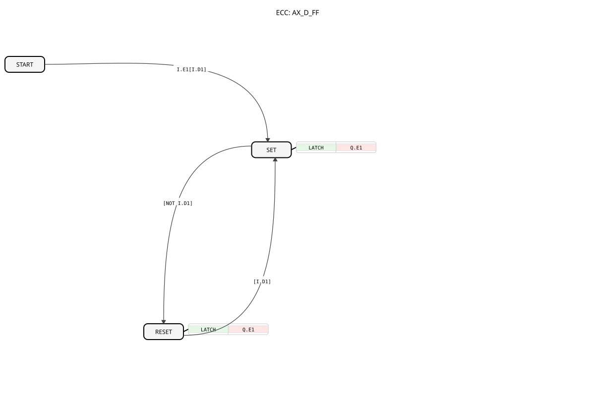

# AX_D_FF


* * * * * * * * * *
## Introduction
The AX_D_FF is a data latch flip-flop that serves as a basic building block in digital circuitry. It is a D-type flip-flop that stores the applied data value and outputs it upon certain events.


## Interface Structure

### **Event Inputs**
- No direct event inputs available

### **Event Outputs**
- No direct event outputs available

### **Data Inputs**
- No direct data inputs available

### **Data Outputs**
- No direct data outputs available

### **Adapters**
- **I** (Socket): Input adapter of type `adapter::types::unidirectional::AX` - Receives the value to be stored
- **Q** (Plug): Output adapter of type `adapter::types::unidirectional::AX` - Outputs the stored value

## Functionality
The AX_D_FF operates as a D-latch flip-flop with three states:

- **START**: Initial state
- **SET**: Stores the input value and outputs it
- **RESET**: Sets the output Back

The LATCH algorithm copies the input value `I.D1` to the output `Q.D1`. The state transitions are controlled by the value of `I.D1`.

``` ## Technical Features
- Uses unidirectional adapters for inputs and outputs
- Implemented as a Basic Function Block according to IEC 61499
- Features simple latch functionality without clocking

## State Overview
1. **START** → **SET**: Upon arrival of `I.E1` with `I.D1 = TRUE`
2. **SET** → **RESET**: When `I.D1 = FALSE`
3. **RESET** → **SET**: When `I.D1 = TRUE`

## Application Scenarios
- Data storage in control systems
- State storage in sequential processes
- Signal delay and buffering
- As a basic building block for more complex flip-flop circuits

## ⚖️ Comparison with similar components
Compared to clocked D flip-flops, the AX_D_FF is asynchronous and saves the value immediately upon a change in the input conditions. It is a level-triggered element rather than an edge-triggered one.

Compare with [E_D_FF](../../../../../StandardLibraries/events/E_D_FF.md)]

## 🛠️ Related Exercises
* [Exercise_170_AX](../../../../../../Uebungen/test_AX/Uebungen_doc/Uebung_170_AX.md)]

## Conclusion
The AX_D_FF offers a simple and effective solution for basic data storage tasks in 4diac control systems. Its clear state logic and the use of standardized adapters make it a reliable component for various use cases.

---

### 🌐 Related Topic Subpages on ms-muc-docs.de
* [🌐 Eclipse 4diac IDE & Color Reference on ms-muc-docs.de](https://www.ms-muc-docs.de/iec-61499/eclipse-4diac/)]
