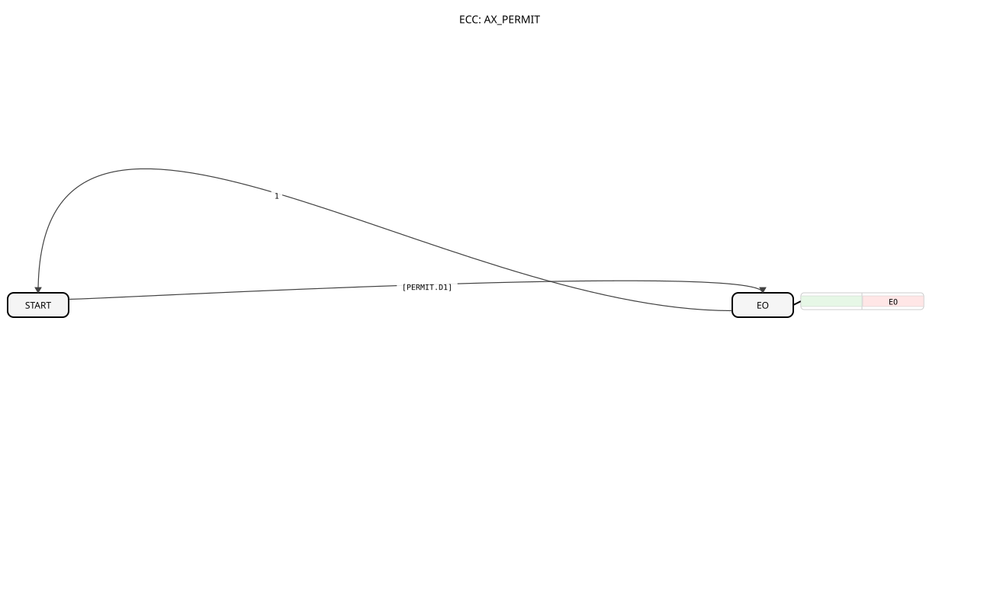

# AX_PERMIT (Unidirectional Adapter Permit)
## Introduction

The `AX_PERMIT` function block is an adapter-based variant of the `E_PERMIT` block, implemented as a **Basic Function Block**. It enables the conditional propagation of an event based on the Boolean data value of an incoming `AX` adapter.
The block receives a combined event and Boolean signal via a `AX` adapter (referred to as `PERMIT`). The incoming event is only forwarded to the output (`EO`) if the Boolean data value of the `PERMIT` adapter (`PERMIT.D1`) is `TRUE`. The data value `PERMIT.D1` is **not** passed on to the output (`EO`), but is only used as a condition.

## Interface Structure

### **Adapter (Socket)**
- **PERMIT**: Input adapter of type `AX` (event `E1` + data `D1`). This adapter controls the function block.

### **Event Outputs**
- **EO**: Pure event output (type `Event`). This event is triggered when the condition is met.

## Functionality

1. **Event Receipt**: When an event (`PERMIT.E1`) arrives at the `PERMIT` socket, the corresponding Boolean data value (`PERMIT.D1`) is checked as a condition.

2. **Conditional Forwarding**: The event output `EO` is triggered only if `PERMIT.D1 = TRUE` is true. Otherwise, the event is blocked.

3. **Data Pass-Through**: The Boolean data value (`PERMIT.D1`) is used by the function block, but **not** passed on via the event output `EO`.

## Technical Features
✔ **Basic Function Block**: Direct implementation of the logic.

✔ **Adapter-Based**: Uses the `AX` adapter as an input.

✔ **Permissive Logic**: Passes on events conditionally.

✔ **No Data Pass-Through at the Output**: The output `EO` is a pure event output and contains no data (`With Var` is undefined).

## Application Scenarios
- **Enable Circuit**: A subsequent function block should only be triggered if an enable condition (`PERMIT.D1 = TRUE`) is active.
- **Conditional Event Control**: Control of the event flow based on an external Boolean status received via an AX adapter.

## 🛠️ Related Exercises
* [Exercise_009_AX](../../../../../../Uebungen/test_AX/Uebungen_doc/Uebung_009_AX.md)]

