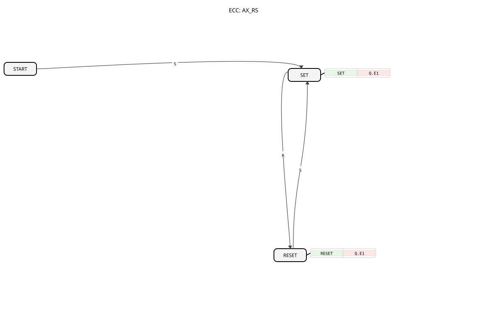

# AX_RS

* * * * * * * * * *
## Introduction

The AX_RS function block is an event-driven bistable element (flip-flop) based on the RS principle. It is a Basic Function Block that implements a set-reset mechanism and communicates via adapter interfaces.

## Interface Structure

### **Event Inputs**

- **R**: Reset event - resets output Q
- **S**: Set event - sets output Q

### **Event Outputs**

No direct event outputs available

### **Data Inputs**

No direct data inputs available

### **Data Outputs**

No direct data outputs available

### **Adapters**

- **Q**: Adapter of type `adapter::types::unidirectional::AX` - represents the value of the flip-flop

## Functionality

The AX_RS function block operates as an RS flip-flop with the following properties:

- Upon the occurrence of an S event (Set), output Q is set to TRUE
- Upon the occurrence of an R event (Reset), output Q is set to FALSE
- The state is retained until a The opposite event occurs

## Technical Features and Comparison with Standards

As with all event-driven bistable elements in IEC 61499 (see also Note 8 in Table A.1 of DIN EN 61499-1), there is no inherent "dominance" of one input, as is known from IEC 61131-3.

- **Comparison to IEC 61131-3**: See [RS (Bistable, priority reset)](../../../../../Vergleich/IEC61131_3/RS_ALT.md). While in the classic PLC world, if S and R1 are TRUE simultaneously, the reset takes precedence, in IEC 61499 each event is processed sequentially. The final state depends on which event was processed last in the execution chain (ECC).
- **Functional Identity**: `AX_RS` is functionally identical to [AX_SR](AX_SR.md). The different naming conventions are solely for consistency with traditional programming and improved readability in the schematic.
- **Adapter Communication**: The component outputs its status exclusively via the adapter `Q` (type `AX`). A change to `Q` triggers the event `Q.E1`.

## State Overview

The function block has three states in the ECC:

1. **START**: Initial state
2. **SET**: State after a set operation (Q.D1 = TRUE)
3. **RESET**: State after a reset operation (Q.D1 = FALSE)

**State Transitions:**

- START → SET: on S event
- SET → RESET: on R event
- RESET → SET: on S event

## Application Scenarios

- Storage of binary states with adapter output
- Implementation of interlock circuits in distributed systems
- State storage in sequential processes
- Signal processing in event-driven systems

## Related Blocks

- **[AX_SR](AX_SR.md)**: Functionally identical, inputs reversed in the symbol.
- **[E_RS](../../../../../StandardLibraries/events/E_RS.md)**: The standard equivalent with direct data/event outputs instead of adapters.

## ⚖️ Comparison with Similar Building Blocks

Compared to other flip-flop implementations:

- Uses adapter-based communication instead of direct data outputs
- Event-driven state changes
- Simple RS logic without additional clock or enable signals

Comparison with [E_RS](../../../../../StandardLibraries/events/E_RS.md)

## 🛠️ Related Exercises

* [Exercise_006b_AX](../../../../../../Uebungen/test_AX/Uebungen_doc/Uebung_006b_AX.md)
* [Exercise_020a_AX](../../../../../../Uebungen/test_AX/Uebungen_doc/Uebung_020a_AX.md)
* [Exercise_020b_AX](../../../../../../Uebungen/test_AX/Uebungen_doc/Uebung_020b_AX.md)
* [Exercise_020d_AX](../../../../../../Uebungen/test_AX/Uebungen_doc/Uebung_020d_AX.md)

## Conclusion

The AX_RS function block provides a simple and efficient implementation of an RS flip-flop for 4diac-based Control systems. Using adapters, it enables flexible integration into various system architectures and is particularly suitable for applications requiring reliable state storage with event-driven updates.

---

### 🌐 Related topic subpages on ms-muc-docs.de

* [🌐 Eclipse 4diac IDE & Color Reference on ms-muc-docs.de](https://www.ms-muc-docs.de/iec-61499/eclipse-4diac/)

]
