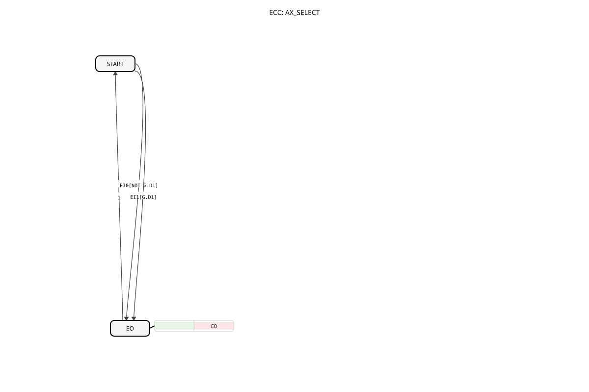

# AX_SELECT

* * * * * * * * * *
## Introduction

The AX_SELECT function block, based on a Boolean input, switches one of two AX adapter inputs to the output.

## Interface Structure

### **Data Inputs**

- **G** (BOOL): Selection signal. FALSE = IN0, TRUE = IN1.

### **Adapters**

**Sockets (Inputs):**

- **IN0** (adapter::types::unidirectional::AX)
- **IN1** (adapter::types::unidirectional::AX)

**Plugs (Outputs):**

- **OUT** (adapter::types::unidirectional::AX)

## Functionality

If G = FALSE, IN0 is passed to OUT.

If G = TRUE, IN1 is forwarded to OUT.

## Technical Features

- Uses unidirectional adapters.

## State Overview

Combinatorial.

## Application Scenarios

Selection of signals.

## ⚖️ Comparison with Similar Function Blocks

- **E_SELECT**: Standard event select without adapters.

## 🛠️ Related Exercises

* [Exercise_095_AX](../../../../../../Uebungen/test_AX/Uebungen_doc/Uebung_095_AX.md)

## Conclusion

Adapter-based select function block.
