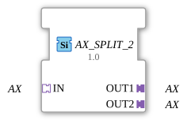

# AX_SPLIT_2

* * * * * * * * * *
## Introduction

The AX_SPLIT_2 function block serves as a generic building block for distributing an AX signal to two separate outputs. The block enables the splitting of an incoming AX signal to two independent output channels.

## Interface Structure

### **Event Inputs**

No direct event inputs available

### **Event Outputs**

No direct event outputs available

### **Data Inputs**

No direct data inputs available

### **Data Outputs**

No direct data outputs available

### **Adapters**

**Input Adapters:**

- **IN**: AX adapter (unidirectional) - Receives the incoming AX signal

**Output Adapters:**

- **OUT1**: AX adapter (unidirectional) - First output channel for the distributed signal
- **OUT2**: AX adapter (unidirectional) - Second output channel for the distributed signal

## Functionality

The AX_SPLIT_2 function block receives an AX signal via the IN adapter and simultaneously distributes this signal to both output adapters OUT1 and OUT2. OUT2. This is a 1:2 distribution, where the incoming signal is passed on to both outputs without modification.

## Technical Features

- Generic implementation for AX signals
- Unidirectional signal transmission
- No signal delay between input and output
- Simultaneous activation of both outputs

## State Overview

The function block operates statelessly – with every incoming signal via the IN adapter, both output adapters are immediately activated.

## Application Scenarios

- Signal distribution in control systems
- Parallel supply of multiple components with the same signal
- Branching of AX communication paths
- Redundant signal routing

## ⚖️ Comparison with Similar Function Blocks

Compared to other distribution blocks, AX_SPLIT_2 offers a specific 1:2 split for AX signals. Other splitter blocks may support different numbers of outputs or other signal types.

Comparison with [E_SPLIT](../../../../../StandardLibraries/events/E_SPLIT.md)

## 🛠️ Related exercises

- [Uebung_002_AX](../../../../../../Uebungen/test_AX/Uebungen_doc/Uebung_002_AX.md)
- [Uebung_004b_AX](../../../../../../Uebungen/test_AX/Uebungen_doc/Uebung_004b_AX.md)
- [Uebung_004b_AX_ASR](../../../../../../Uebungen/test_AX/Uebungen_doc/Uebung_004b_AX_ASR.md)
- [Uebung_004b_AX_ASR_X](../../../../../../Uebungen/test_AX/Uebungen_doc/Uebung_004b_AX_ASR_X.md)
- [Uebung_006a3_sub_AX](../../../../../../Uebungen/test_AX/Uebungen_doc/Uebung_006a3_sub_AX.md)
- [Uebung_007a3_AX](../../../../../../Uebungen/test_AX/Uebungen_doc/Uebung_007a3_AX.md)
- [Uebung_008_AX](../../../../../../Uebungen/test_AX/Uebungen_doc/Uebung_008_AX.md)
- [Uebung_010c2_AX](../../../../../../Uebungen/test_AX/Uebungen_doc/Uebung_010c2_AX.md)
- [Uebung_010c3_sub_AX](../../../../../../Uebungen/test_AX/Uebungen_doc/Uebung_010c3_sub_AX.md)
- [Uebung_010c4_sub_AX](../../../../../../Uebungen/test_AX/Uebungen_doc/Uebung_010c4_sub_AX.md)
- [Uebung_010c_AX](../../../../../../Uebungen/test_AX/Uebungen_doc/Uebung_010c_AX.md)
- [Uebung_020c3_AX](../../../../../../Uebungen/test_AX/Uebungen_doc/Uebung_020c3_AX.md)
- [Uebung_020e2_AX](../../../../../../Uebungen/test_AX/Uebungen_doc/Uebung_020e2_AX.md)
- [Uebung_020f2_AX](../../../../../../Uebungen/test_AX/Uebungen_doc/Uebung_020f2_AX.md)
- [Uebung_020j2_AX_sub](../../../../../../Uebungen/test_AX/Uebungen_doc/Uebung_020j2_AX_sub.md)
- [Exercise_020j_AX](../../../../../../Uebungen/test_AX/Uebungen_doc/Uebung_020j_AX.md)
- [Exercise_035a2_AX](../../../../../../Uebungen/test_AX/Uebungen_doc/Uebung_035a2_AX.md)
- [Exercise_035a3_AX](../../../../../../Uebungen/test_AX/Uebungen_doc/Uebung_035a3_AX.md)
- [Exercise_094a_AX](../../../../../../Uebungen/test_AX/Uebungen_doc/Uebung_094a_AX.md)
- [Exercise_160_AX](../../../../../../Uebungen/test_AX/Uebungen_doc/Uebung_160_AX.md)
- [Exercise_160b2_AX](../../../../../../Uebungen/test_AX/Uebungen_doc/Uebung_160b2_AX.md)
- [Exercise_160b_AX](../../../../../../Uebungen/test_AX/Uebungen_doc/Uebung_160b_AX.md)

## Change Detection

Each output plug is updated independently: the incoming value is written to a given output, and its adapter event sent, only if it differs from that output's current value. Outputs that are already in sync stay quiet, while an output that was just connected (or has drifted out of sync) still receives the update it needs.

## Conclusion

The AX_SPLIT_2 function block provides a simple and efficient solution for distributing AX signals to two outputs. Its generic nature and unidirectional architecture make it a versatile building block. in distributed automation systems.
