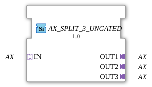

# AX_SPLIT_3_UNGATED

> ℹ️ **UNGATED variant:** This block is the ungated version of [`AX_SPLIT_3`](AX_SPLIT_3.md). It suppresses **no** unchanged repeats – every newly computed result is forwarded unconditionally, even without a value change. This matters for consumers that need a periodic cadence regardless of value change (e.g. derivative/frequency calculations that would otherwise fail to decay toward zero). Any change-detection/gating statements further down this page do **not** apply to this block.

* * * * * * * * * *
## Introduction

The AX_SPLIT_3_UNGATED is a generic function block that splits one AX adapter input into three separate AX adapter outputs. This block allows the distribution of an incoming AX signal to three different receivers within a 4diac system.

## Interface Structure

### **Event Inputs**

*No event inputs available*

### **Event Outputs**

*No event outputs available*

### **Data Inputs**

*No data inputs available*

### **Data Outputs**

*No data outputs available*

### **Adapters**

**Input Adapters:**

- **IN** - AX adapter (socket) - Receives the incoming AX signal

**Output Adapters:**

- **OUT1** - AX adapter (plug) - First output channel
- **OUT2** - AX adapter (plug) - Second output channel
- **OUT3** - AX adapter (plug) - Third output channel

## Functionality

The functional block acts as a signal distributor for unidirectional AX adapters. Every incoming signal at the IN adapter is forwarded in parallel to all three output adapters (OUT1, OUT2, OUT3). The distribution is synchronous, so all outputs are activated simultaneously.

## Technical Features

- Uses unidirectional AX adapters for communication
- Implemented as a generic function block (GEN_AX_SPLIT)
- No event or data inputs - operates exclusively via adapters
- Plug-and-socket architecture according to IEC 61499 standard

## State Overview

The function block has a simple state: In the operating state, it forwards incoming signals unchanged to all three outputs. There are no internal state transitions or delays.

## Application Scenarios

- Distribution of control signals to multiple actuators
- Parallel control of multiple devices with the same signal
- Signal branching in complex control architectures
- Redundant signal distribution for safety applications

## ⚖️ Comparison with similar function blocks

Compared to other distribution function blocks, AX_SPLIT_3_UNGATED stands out due to its specific focus on AX adapters. While general distribution function blocks can support various adapter types, this function block is specifically optimized for AX adapters.

Comparison with [E_SPLIT](../../../../../StandardLibraries/events/E_SPLIT.md)

## 🛠️ Related Exercises

- [Exercise_002a5b_AX](../../../../../../Uebungen/test_AX/Uebungen_doc/Uebung_002a5b_AX.md)
- [Exercise_006a3_AX](../../../../../../Uebungen/test_AX/Uebungen_doc/Uebung_006a3_AX.md)
- [Exercise_009_AX](../../../../../../Uebungen/test_AX/Uebungen_doc/Uebung_009_AX.md)

## Change Detection

This block performs **no** change detection. Every newly computed result is written to the output and its adapter event fired unconditionally, regardless of whether the value differs from the previous run.

## Conclusion

The AX_SPLIT_3_UNGATED offers a simple and efficient solution for signal distribution in 4diac systems. Its generic implementation and standards-compliant adapter interface make it a versatile component for various automation applications.

### 🌐 Related topic subpages on ms-muc-docs.de

- [🌐 Eclipse 4diac IDE & Color Reference on ms-muc-docs.de](https://www.ms-muc-docs.de/iec-61499/eclipse-4diac/)

]
