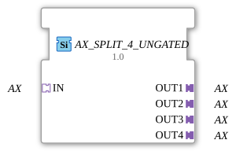

# AX_SPLIT_4_UNGATED

> ℹ️ **UNGATED variant:** This block is the ungated version of [`AX_SPLIT_4`](AX_SPLIT_4.md). It suppresses **no** unchanged repeats – every newly computed result is forwarded unconditionally, even without a value change. This matters for consumers that need a periodic cadence regardless of value change (e.g. derivative/frequency calculations that would otherwise fail to decay toward zero). Any change-detection/gating statements further down this page do **not** apply to this block.

* * * * * * * * * *
## Introduction

The AX_SPLIT_4_UNGATED function block is a generic function block that splits one AX adapter input into four separate AX adapter outputs. The block acts as a distributor for unidirectional AX adapters and enables the transmission of data and events to multiple receivers.

## Interface Structure

### **Event Inputs**

No direct event inputs available (event processing is handled via adapters)

### **Event Outputs**

No direct event outputs available (event processing is handled via adapters)

### **Data Inputs**

No direct data inputs available (data processing is handled via adapters)

### **Data Outputs**

No direct data outputs available (data processing is handled via adapters)

### **Adapters**

**Input Adapter:**

- `IN` - AX Adapter (Socket) - Receives unidirectional AX data and events

**Output Adapter:**

- `OUT1` - AX Adapter (Plug) - First output channel
- `OUT2` - AX Adapter (Plug) - Second Output Channel
- `OUT3` - AX Adapter (Plug) - Third Output Channel
- `OUT4` - AX Adapter (Plug) - Fourth Output Channel

## Functionality

The AX_SPLIT_4_UNGATED block receives data and events via the input adapter `IN` and distributes them in parallel to all four output adapters (`OUT1` to `OUT4`). All incoming information is forwarded to all outputs simultaneously, thus achieving a 1:4 distribution.

## Technical Features

- Generic implementation for maximum reusability
- Uses unidirectional AX adapters for data transmission
- No buffering or delay in data transmission
- Parallel distribution without output prioritization

## State Overview

The function block operates statelessly – incoming data and events are immediately forwarded to all outputs without storing any internal state.

## Application Scenarios

- Distribution of control commands to multiple actuators
- Broadcasting of sensor data to various processing units
- Distribution of control information in distributed systems
- Redundant data distribution for safety applications

## ⚖️ Comparison with Similar Function Blocks

Compared to simple split function blocks, AX_SPLIT_4_UNGATED offers a specific 1:4 split for AX adapters. Other split variants may support different numbers of outputs or other adapter types.

Comparison with [E_SPLIT](../../../../../StandardLibraries/events/E_SPLIT.md)

## Change Detection

This block performs **no** change detection. Every newly computed result is written to the output and its adapter event fired unconditionally, regardless of whether the value differs from the previous run.

## Conclusion

The AX_SPLIT_4_UNGATED function block offers a simple and efficient solution for distributing AX adapter data to four parallel outputs. Its generic nature and the use of standardized adapters make it versatile for use in various automation applications.
