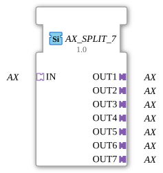

# AX_SPLIT_7

* * * * * * * * * *
## Introduction

The AX_SPLIT_7 function block is a generic component that splits a single AX adapter input into seven separate AX adapter outputs. The component acts as a distributor for unidirectional AX adapters and allows a single input signal to be distributed to multiple receivers.

## Interface Structure

### **Event Inputs**

No direct event inputs available (adapter-based communication)

### **Event Outputs**

No direct event outputs available (adapter-based communication)

### **Data Inputs**

No direct data inputs available (adapter-based communication)

### **Data Outputs**

No direct data outputs available (adapter-based communication)

### **Adapters**

**Input Adapter:**

- **IN** (Socket): Unidirectional AX adapter input

**Output Adapter:**

- **OUT1** (Plug): Unidirectional AX adapter output 1
- **OUT2** (Plug): Unidirectional AX adapter output 2
- **OUT3** (Plug): Unidirectional AX Adapter Output 3
- **OUT4** (Plug): Unidirectional AX Adapter Output 4
- **OUT5** (Plug): Unidirectional AX Adapter Output 5
- **OUT6** (Plug): Unidirectional AX Adapter Output 6
- **OUT7** (Plug): Unidirectional AX Adapter Output 7

## Functionality

The AX_SPLIT_7 function block receives data via the input adapter IN and simultaneously distributes it to all seven output adapters (OUT1 to OUT7). Each signal received at the IN adapter is forwarded in parallel to all seven outputs, thus achieving a 1:7 distribution.

## Technical Features

- Generic implementation for maximum reusability
- Uses unidirectional AX adapters for communication
- No internal delays in signal distribution
- Parallel output to all seven outputs

## State Overview

The function block has a simple state: In the active state, it immediately forwards incoming signals to all outputs. There are no complex state transitions or internal processing logic.

## Application Scenarios

- Distribution of control signals to multiple actuators
- Splitting of sensor data to different processing units
- Signal distribution in branched control architectures
- Redundant signal forwarding to multiple receivers

## ⚖️ Comparison with Similar Components

Compared to simpler splitter components, AX_SPLIT_7 offers a fixed number of seven outputs, which is optimized for specific use cases with exactly seven receivers. Compared to variable splitters, this component has the advantage of fixed interfaces.

Comparison with [E_SPLIT](../../../../../StandardLibraries/events/E_SPLIT.md)]

## Conclusion

The AX_SPLIT_7 function block provides an efficient solution for distributing unidirectional AX signals to seven receivers. Its generic nature and simple operation make it a robust and reliable component for distributed control systems.