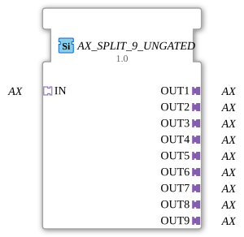

# AX_SPLIT_9_UNGATED

> ℹ️ **UNGATED variant:** This block is the ungated version of [`AX_SPLIT_9`](AX_SPLIT_9.md). It suppresses **no** unchanged repeats – every newly computed result is forwarded unconditionally, even without a value change. This matters for consumers that need a periodic cadence regardless of value change (e.g. derivative/frequency calculations that would otherwise fail to decay toward zero). Any change-detection/gating statements further down this page do **not** apply to this block.

* * * * * * * * * *
## Introduction

The AX_SPLIT_9_UNGATED function block is a generic component that splits a single AX adapter into nine separate AX outputs. The block acts as a distributor for unidirectional adapter connections and allows a single input signal to be distributed across multiple output channels.

## Interface Structure

### **Event Inputs**

*No direct event inputs available*

### **Event Outputs**

*No direct event outputs available*

### **Data Inputs**

*No direct data inputs available*

### **Data Outputs**

*No direct data outputs available*

### **Adapters**

**Input Adapters:**

- `IN` - Unidirectional AX adapter (socket)

**Output Adapters:**

- `OUT1` to `OUT9` - Nine unidirectional AX adapters (plugs)

## Functionality

The AX_SPLIT_9_UNGATED block functions as an adapter splitter, which receives incoming signals and data from the input adapter. The input signal is distributed in parallel to all nine output adapters (`IN` to `OUT9`). Each output receives an identical copy of the input signal.

## Technical Features

- Generic implementation for maximum reusability
- Unidirectional adapter architecture
- Parallel signal distribution without delay
- No data processing or modification

## State Overview

The function block has a simple state: When the input adapter is activated, all nine output adapters are activated simultaneously.

## Application Scenarios

- Distribution of control signals to multiple actuators
- Distribution of sensor values to different processing units
- Signal distribution in complex control systems
- Redundant signal routing

## ⚖️ Comparison with Similar Blocks

Compared to simpler splitter blocks, AX_SPLIT_9_UNGATED offers a higher number of outputs (9 instead of the typical 2-4). Compared to serial distributors, it allows simultaneous activation of all outputs without sequential delay.

Comparison with [E_SPLIT](../../../../../StandardLibraries/events/E_SPLIT.md)

- **[`AX_SPLIT_9`](AX_SPLIT_9.md)**: The gated variant – updates the output only on an actual value change.

## Change Detection

This block performs **no** change detection. Every newly computed result is written to the output and its adapter event fired unconditionally, regardless of whether the value differs from the previous run.

## Conclusion

The AX_SPLIT_9_UNGATED function block represents an efficient solution for the parallel distribution of unidirectional adapter signals. Its generic nature and the high number of outputs make it particularly suitable for complex control applications where a signal needs to be distributed to multiple receivers.
