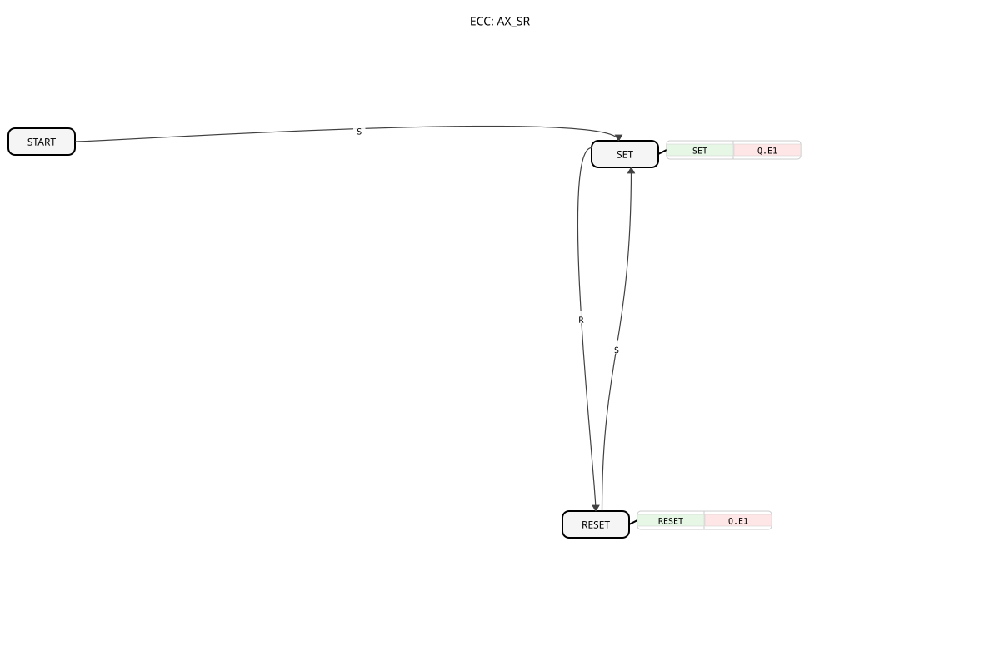

# AX_SR

* * * * * * * * * *

## Introduction

The AX_SR function block is an event-driven bistable element (flip-flop) that functions as a set-reset memory. It allows setting and resetting a logical state and makes this state available via an adapter interface.

## Interface Structure

### **Event Inputs**

- **S**: Sets output Q to TRUE
- **R**: Sets output Q to FALSE

### **Event Outputs**

- No direct event outputs available

### **Data Inputs**

- No data inputs available

### **Data Outputs**

- No direct data outputs available

### **Adapters**

- **Q**: Unidirectional adapter of type "adapter::types::unidirectional::AX", which provides the current state of the flip-flop

## Functionality

The AX_SR function block operates as a set-reset flip-flop with the following properties:

- On an S event, the internal state is set to SET and output Q to TRUE
- On an R event, the internal state is set to RESET and output Q to FALSE
- The state Remains in state until a contrary event occurs.
- State changes are communicated via adapter Q.

## Technical Features and Comparison with Standards

As with all event-driven bistable elements in IEC 61499 (see also Note 8 in Table A.1 of DIN EN 61499-1), there is no inherent "dominance" of one input, as is known from IEC 61131-3.

- **Comparison to IEC 61131-3**: See [SR (Bistable, set with priority)](../../../../../Vergleich/IEC61131_3/SR_ALT.md). While in the classic PLC world, if S1 and R are TRUE simultaneously, the set takes precedence, in IEC 61499, each event is processed sequentially. The final state depends on which event was processed last in the execution chain (ECC).
- **Functional Identity**: `AX_SR` is functionally identical to [AX_RS](AX_RS.md). The different naming and pin arrangement are solely for the convenience of developers familiar with IEC 61131-3.
- **Adapter Communication**: The device makes its status available via the adapter `Q`.

## State Overview

1. **START**: Initial state
2. **SET**: State after S-event, output Q.D1 = TRUE
3. **RESET**: State after R-event, output Q.D1 = FALSE

State Transitions:

- START → SET: On S-event
- SET → RESET: On R-event
- RESET → SET: On S-event

## Application Scenarios

- Storage of switching states in distributed control applications
- State management via adapter interfaces
- Signal processing with memory function
- Monitoring of operating states

## Related Function Blocks

- **[AX_RS](AX_RS.md)**: Functionally identical, inputs reversed in the symbol.
- **[E_SR](../../../../../StandardLibraries/events/E_SR.md)**: The standard equivalent with direct data/event outputs instead of adapters.

## ⚖️ Comparison with Similar Building Blocks

Compared to other memory elements, AX_SR offers:

- Clear separation of set and reset functionality
- Adapter-based interface for flexible integration
- Event-driven state changes
- Simple and robust state management

Comparison with [E_SR](../../../../../StandardLibraries/events/E_SR.md)

## 🛠️ Related Exercises

- [Exercise_004b_AX](../../../../../../Uebungen/test_AX/Uebungen_doc/Uebung_004b_AX.md)
- [Exercise_004b_AX_ASR](../../../../../../Uebungen/test_AX/Uebungen_doc/Uebung_004b_AX_ASR.md)
- [Exercise_004b_AX_ASR_X](../../../../../../Uebungen/test_AX/Uebungen_doc/Uebung_004b_AX_ASR_X.md)
- [Exercise_006_AX](../../../../../../Uebungen/test_AX/Uebungen_doc/Uebung_006_AX.md)
- [Exercise_006d_AX](../../../../../../Uebungen/test_AX/Uebungen_doc/Uebung_006d_AX.md)
- [Exercise_007a3_AX](../../../../../../Uebungen/test_AX/Uebungen_doc/Uebung_007a3_AX.md)
- [Exercise_008_AX](../../../../../../Uebungen/test_AX/Uebungen_doc/Uebung_008_AX.md)
- [Exercise_009_AX](../../../../../../Uebungen/test_AX/Uebungen_doc/Uebung_009_AX.md)
- [Exercise_013_AX](../../../../../../Uebungen/test_AX/Uebungen_doc/Uebung_013_AX.md)
- [Exercise_160b_AX](../../../../../../Uebungen/test_AX/Uebungen_doc/Uebung_160b_AX.md)
- [Exercise_171_AX](../../../../../../Uebungen/test_AX/Uebungen_doc/Uebung_171_AX.md)

## Conclusion

The AX_SR function block provides a reliable and easy-to-use solution for bistable memory functions in distributed automation systems. Through the use of adapters, it enables flexible integration into various system architectures and offers a clear, event-driven interface for Set-reset operations.
