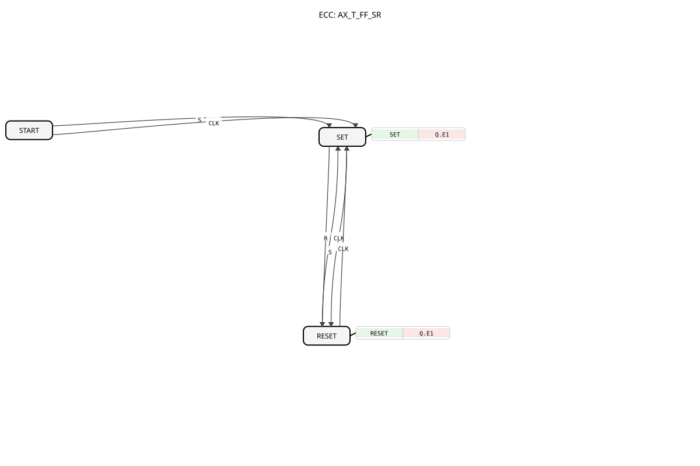

# AX_T_FF_SR

* * * * * * * * * *
## Introduction

The AX_T_FF_SR is an event-driven bistable function block with toggle functionality. It is a flip-flop element that can operate as both a set-reset flip-flop and a toggle flip-flop. The component combines the properties of an SR flip-flop with additional toggle functionality via a clock input.

## Interface Structure

### **Event Inputs**

- **S**: Sets output Q to TRUE
- **R**: Sets output Q to FALSE (Reset)
- **CLK**: Clock signal for toggling the output

### **Event Outputs**

- No direct event outputs available

### **Data Inputs**

- No data inputs available

### **Data Outputs**

- No direct data outputs available

### **Adapters**

- **Q**: Unidirectional AX-type adapter that provides the flip-flop value

## Operation

The AX_T_FF_SR has three operating states:

- **START**: Initial state
- **SET**: Output Q is TRUE
- **RESET**: Output Q is FALSE

The state transitions are controlled by the event inputs:

- The S event transitions from any state to the SET state.

The R event transitions from any state to the RESET state.

The CLK event toggles the current state (SET → RESET or RESET → SET).

With each state change, the corresponding algorithm is executed, setting the adapter value Q.D1 accordingly.

## Technical Features

- Combines SR flip-flop and T flip-flop functionality
- Uses the adapter interface for data output
- Unidirectional communication via the Q adapter
- Initial state is START, from which a transition to SET can occur directly or via CLK

## State Overview

START (Initialzustand)
│
├── S ───→ SET (Q.D1 = TRUE)
│
└── CLK ─→ SET (Q.D1 = TRUE)

SET (Q.D1 = TRUE)
│
├── R ────→ RESET (Q.D1 = FALSE)
│
└── CLK ─→ RESET (Q.D1 = FALSE)

RESET (Q.D1 = FALSE)
│
├── S ────→ SET (Q.D1 = TRUE)
│
└── CLK ─→ SET (Q.D1 = TRUE)
## Application Scenarios

- State storage in control applications
- Clock and frequency division
- Event counting
- State machines with memory function
- Switching networks with feedback

## ⚖️ Comparison with similar components

Compared to a simple E_SR flip-flop, the AX_T_FF_SR offers additional toggle functionality through its CLK input. While a pure SR flip-flop only has set and reset inputs, this component also allows clock-controlled switching of the output state.

Comparison with [E_T_FF_SR](../../../../../StandardLibraries/events/E_T_FF_SR.md)

## 🛠️ Related exercises

* [Uebung_004a7_AX](../../../../../../Uebungen/test_AX/Uebungen_doc/Uebung_004a7_AX.md)
* [Uebung_006a2_AX](../../../../../../Uebungen/test_AX/Uebungen_doc/Uebung_006a2_AX.md)
* [Uebung_006a3_AX](../../../../../../Uebungen/test_AX/Uebungen_doc/Uebung_006a3_AX.md)
* [Uebung_006a4_AX](../../../../../../Uebungen/test_AX/Uebungen_doc/Uebung_006a4_AX.md)
* [Uebung_006a_AX](../../../../../../Uebungen/test_AX/Uebungen_doc/Uebung_006a_AX.md)

## Conclusion

The AX_T_FF_SR is a versatile bistable memory device that combines the advantages of SR and T flip-flops. Thanks to its adapter-based interface, it enables flexible integration into larger control systems and is particularly suitable for applications that require both direct state setting and clock-controlled switching.
