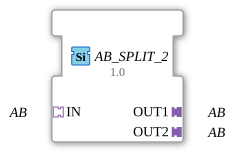

# AB_SPLIT_2

* * * * * * * * * *
## Introduction

The function block **AB_SPLIT_2** splits a unidirectional adapter of type `AB` into two separate adapter outputs. It is implemented as a generic function block (Generic FB) and allows the simultaneous forwarding of the incoming adapter to two independent target addresses. This simplifies the topology in control applications when a signal is needed multiple times without affecting the original data flow.
## Interface Structure

### **Event Inputs**

No event inputs are available.

### **Event Outputs**

No event outputs are available. Adapter communication occurs without events via the data exchange mechanism of the adapter type.

### **Data Inputs**

No data inputs are available. Data flows exclusively through the adapter input `IN`.

### **Data Outputs**

No data outputs are available. Outputs are provided via the adapter outputs `OUT1` and `OUT2`.

### **Adapter**

| Role | Name | Type | Direction |
|--------|------|-----------------------------------|----------|
| Socket | IN | `adapter::types::unidirectional::AB` | Input |
| Plug | OUT1 | `adapter::types::unidirectional::AB` | Output |
| Plug | OUT2 | `adapter::types::unidirectional::AB` | Output |

## Functionality

The function block forwards the adapter connected via socket `IN` unchanged to both plugs `OUT1` and `OUT2`. Any change to the data or state of the incoming adapter is propagated simultaneously to both outputs. The distribution occurs without delay or buffering – it is a pure distribution logic.

## Technical Features

- **Generic Function Block:** The function block is declared as a generic type (`GEN_AB_SPLIT`), so it can work with different subtypes of the adapter `AB`, provided they have the same unidirectional semantics.
- **Unidirectionality:** The adapter is designed exclusively in one direction – data flows from the socket to the plugs. Backward communication is not supported.
- **License:** This function block is licensed under the Eclipse Public License 2.0 (EPL-2.0), which permits free use, modification, and distribution in your own projects.
- **No State Machines:** The function block has no internal states or event-driven processes, as adapter routing is entirely data-driven.

## State Overview

The function block does not have a state machine. The output adapters always reflect the current state of the input adapter.

## Application Scenarios

- **Signal Distribution in Modular Systems:** Separation of a sensor signal from a fieldbus component for parallel processing in two independent control logics.
- **Redundancy Setup:** An incoming signal can be sent to different controllers or monitoring units via two separate paths.
- **Prototypes and Test Setups:** Easy duplication of an adapter stream for simulation and debugging purposes without modifying the actual application.

## Comparison with Similar Function Blocks

Compared to dedicated **SPLIT FBs** with event/data ports, `AB_SPLIT_2` operates purely on an adapter basis. While classic split function blocks often require triggered data copies, distribution here occurs continuously and without explicit activation. Adapter multiplexers or bus couplers offer similar functionality, but with more complex configurations. This function block is specifically designed for the unidirectional `AB` adapter.

## Change Detection

Each output plug is updated independently: the incoming value is written to a given output, and its adapter event sent, only if it differs from that output's current value. Outputs that are already in sync stay quiet, while an output that was just connected (or has drifted out of sync) still receives the update it needs.

## Conclusion

AB_SPLIT_2` is a simple yet effective generic function block for splitting a unidirectional adapter into two outputs. It increases the flexibility of adapter cabling in industrial control systems according to IEC 61499 and is freely available thanks to the EPL 2.0 license. For applications requiring a 1:2 distribution of adapter data, it offers a clean and maintainable solution.
