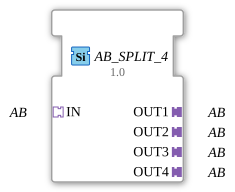

# AB_SPLIT_4

* * * * * * * * * *
## Introduction

The function block **AB_SPLIT_4** is used to distribute a single incoming unidirectional adapter connection of type `AB` to four parallel outgoing adapter connections of the same type. It is designed as a generic block and enables the distribution of a data or signal flow across multiple downstream components.
## Interface Structure

### **Event Inputs**

None.

### **Event Outputs**

None.

### **Data Inputs**

None.

### **Data Outputs**

None.

### **Adapters**

| Direction | Name | Type | Description |
|----------|------|-----|--------------|
Socket | `IN` | `adapter::types::unidirectional::AB` | Incoming unidirectional adapter connection |
Plug | `OUT1` | `adapter::types::unidirectional::AB` | First outgoing adapter connection |
Plug | `OUT2` | `adapter::types::unidirectional::AB` | Second outgoing adapter connection |
Plug | `OUT3` | `adapter::types::unidirectional::AB` | Third outgoing adapter connection |
Plug | `OUT4` | `adapter::types::unidirectional::AB` | Fourth Outgoing Adapter Connection |

## Functionality

This component functions as a passive splitter at the adapter level. As soon as an adapter connection of type `AB` is established at socket `IN`, the component forwards the data or signals arriving via this connection unchanged to all four plugs `OUT1` to `OUT4`. The distribution occurs without data modification or buffering. The component has no events or data points of its own; all communication takes place exclusively via the adapter interfaces.

## Technical Features

- **Generic Design:** The function block is implemented as a generic FB (`GenericClassName = 'GEN_AB_SPLIT'`) and can therefore be used for various specific implementations of the adapter type `AB`.
- **Unidirectionality:** The adapters are declared as unidirectional. This means that data flow occurs only in one direction (from the socket to the plugs). No return channels are provided.
- **No Active Logic:** The function block contains no algorithm or state machine. It functions purely passively as a wiring aid at the architecture level.
- **Simplicity:** The function block reduces the complexity of system wiring by modeling a physical or logical division of an adapter signal.

## State Overview

The function block does not have an internal state machine (ECC – Execution Control Chart). It behaves statically and forwards the data present at `IN` to all outputs throughout its entire runtime. There are no interrupt or initialization states.

## Application Scenarios

- **Distributing Sensor Values:** A sensor delivers data via a `AB` adapter, which must be forwarded in parallel to several control modules or display units.
- **Test and Diagnostic Environments:** A data stream is sent to a processing unit and simultaneously to a logging or monitoring component.
- **Modular Systems:** Within a larger automation application, the function block can be used to split a common bus signal to several downstream function blocks.

## Comparison with Similar Function Blocks

Similar splitter function blocks exist for other adapter types or for data-based forwarding. The `AB_SPLIT_4` is characterized by its specific fit for the adapter type `AB` and its unidirectional design. Unlike function blocks with event or data interfaces, it requires no additional clocking or synchronization – the distribution is implicit in the connection topology.

## Conclusion

The `AB_SPLIT_4` is a simple yet useful generic function block for multiplying a unidirectional adapter connection. It simplifies the structuring of control applications by avoiding redundant wiring and enabling a clear distribution of signal pins. Its generic implementation makes it flexible and usable in various contexts.
