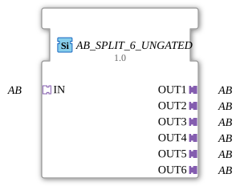

# AB_SPLIT_6_UNGATED

> ℹ️ **UNGATED variant:** This block is the ungated version of [`AB_SPLIT_6`](AB_SPLIT_6.md). It suppresses **no** unchanged repeats – every newly computed result is forwarded unconditionally, even without a value change. This matters for consumers that need a periodic cadence regardless of value change (e.g. derivative/frequency calculations that would otherwise fail to decay toward zero). Any change-detection/gating statements further down this page do **not** apply to this block.

* * * * * * * * * *

## Introduction

The function block **AB_SPLIT_6_UNGATED** is a generic adapter splitter. It serves to distribute an incoming unidirectional adapter data stream (type `AB`) simultaneously to six separate outputs. This allows the data from a single adapter to be made available to multiple downstream blocks without data loss.

## Interface Structure

### **Event Inputs**

The block has no event inputs. Data is passed exclusively via the adapter interface.

### **Event Outputs**

There are no event outputs. Output is provided solely via the adapters.

### **Data Inputs**

The block has no separate data inputs. The actual user data is transported via the adapter input `IN`.

### **Data Outputs**

There are no explicit data outputs. The distributed data is provided via the adapter outputs `OUT1` to `OUT6`.

### **Adapters**

| Type | Name | Direction | Description |
| ----- | ------ | ---------- | -------------- |
| `adapter::types::unidirectional::AB` | `IN` | Socket | Input adapter that supplies the data to be distributed. |
| `adapter::types::unidirectional::AB` | `OUT1` | Plug | First output adapter – receives a copy of the input data. |
| adapter::types::unidirectional::AB` | `OUT2` | Plug | Second output adapter. |
| adapter::types::unidirectional::AB` | `OUT3` | Plug | Third output adapter. |
| adapter::types::unidirectional::AB` | `OUT4` | Plug | Fourth output adapter. |
| adapter::types::unidirectional::AB` | `OUT5` | Plug | Fifth output adapter. |
| adapter::types::unidirectional::AB` | `OUT6` | Plug | Sixth output adapter. |

## Functionality

The function block reads the data arriving from adapter `IN` and forwards it identically to all six output adapters `OUT1` to `OUT6`. This is a pure 1:6 distribution without buffering or data processing. As soon as data is present at the input, it is immediately and simultaneously transferred to all outputs. The number of outputs is fixed at six.

## Technical Features

- **Generic Function Block**: The function block is implemented as a generic type (`GEN_AB_SPLIT`) and can be used multiple times within the 4diac IDE framework.
- **Unidirectional Interface**: All adapters are of type `unidirectional::AB`, meaning that data flow is only in one direction (from the input to the outputs).
- **No State Dependency**: Since neither events nor trigger mechanisms exist, the function block operates continuously and without an internal state.
- **License**: The function block is licensed under the Eclipse Public License 2.0 (EPL-2.0).

## State Overview

The function block has no internal state machine or discrete states. Its operation is purely continuous – there is no initialization, no error states, and no time dependencies.

## Application Scenarios

- **Data Distribution in Control Applications**: When a sensor or data source (e.g., an IO-Link master via a `AB` adapter) needs to provide its measured values to several function blocks operating in parallel.
- **Redundant Processing**: An input signal is simultaneously forwarded to multiple independent calculation or monitoring logics.
- **Prototyping**: Easily duplicate an adapter signal during the development phase without having to write your own splitter logic.

## Comparison with similar components

- **AB_SPLIT_2 / AB_SPLIT_4**: Analogous design, but with two or four outputs, respectively. This component offers the maximum of six outputs.
- **Generic Splits with Events**: Some splitters operate in an event-driven manner (e.g., `E_SPLIT`), but then require additional triggers. In contrast, `AB_SPLIT_6_UNGATED` operates continuously and without events via the adapter interface.
- **Data Splitters (e.g., `F_SPLIT`)**: These split individual data values (e.g., an array), while `AB_SPLIT_6_UNGATED` copies the entire adapter data stream unchanged.

## Change Detection

This block performs **no** change detection. Every newly computed result is written to the output and its adapter event fired unconditionally, regardless of whether the value differs from the previous run.

## Conclusion

The `AB_SPLIT_6_UNGATED` is a simple yet useful generic function block for multiplying a unidirectional adapter signal to up to six outputs. It is easy to understand, requires no configuration, and is ideally suited for the rapid distribution of adapter data in industrial control applications.

---

### 🌐 Related topic subpages on ms-muc-docs.de

- [🌐 Eclipse 4diac IDE & color reference on ms-muc-docs.de ](https://www.ms-muc-docs.de/iec-61499/eclipse-4diac/)
