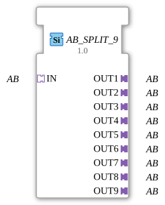

# AB_SPLIT_9

* * * * * * * * * *
## Introduction
The function block **AB_SPLIT_9** is used to split a single incoming adapter of type **AB** into nine identical outgoing adapters (**OUT1** to **OUT9**). It is implemented as a generic block (GenericClassName = `'GEN_AB_SPLIT'`) and can be used in any 4diac project to establish a point-to-multipoint connection via the adapter interface.
The block has no event-driven or data-driven inputs/outputs – all communication takes place exclusively via the adapter interfaces. This enables clean, task-oriented coupling of modules.
## Interface Structure
### **Event Inputs**
None available.

### **Event Outputs**
None available.

### **Data Inputs**
None available.

### **Data Outputs**
None available.

### **Adapters**

| Interface | Direction | Type | Description |
|--------------|----------|-----|--------------|
| IN | Socket | `adapter::types::unidirectional::AB` | Incoming adapter (source) |
| OUT1 – OUT9 | Plug | `adapter::types::unidirectional::AB` | Nine identical outgoing adapters (sinks) |

## Functionality
This function block copies all data and event traffic from the incoming adapter **IN** to the nine output adapters **OUT1** to **OUT9**. Each output receives exactly the same information as the input – no filtering, transformation, or delay takes place.

The function block thus behaves like a **passive distributor** (splitting node) at the adapter level. Changes to the input adapter (e.g., new values or events) are immediately propagated to all outputs, provided the connected modules allow this.

## Technical Features
- **Generic Type**: The function block is declared as a generic FB (`GenericClassName = 'GEN_AB_SPLIT'`). This allows it to be reused in different contexts, as long as the adapter type `unidirectional::AB` is compatible.
- **No State Logic**: There is no ECC (Execution Control Chart) – the function block is completely declarative and does not require sequential processing.
- **Easy Extensibility**: The principle can be applied to other numbers of outputs (e.g., `AB_SPLIT_4`, `AB_SPLIT_16`) by adapting the XML structure accordingly.

## State Overview
The function block has **no** states of its own. Its behavior is purely combinatorial – distribution occurs continuously and without delay. Therefore, a state machine is not required.

## Application Scenarios
- **Control of Multiple Parallel Actuators**: A sensor (e.g., a pressure sensor) delivers its measured value via an AB adapter. This value is to be simultaneously transmitted to several actuators (valves, motors) – the split function block distributes the information to all of them.
- **Signal Coupling in Modular Systems**: In a distributed automation solution, multiple subsystems can receive the same data stream without each subsystem having to establish a separate connection to the source.
- **Test and Simulation Environments**: An incoming data stream can be split across multiple monitoring or logging modules without affecting the original connection.

## Comparison with Similar Components

| Component | Outputs | Special Feature |
|----------|----------|--------------|
| `AB_SPLIT_9` | 9 | Standard split for 1→9, generic |
| `AB_SPLIT_4` | 4 | Same functionality, fewer outputs |
| `AB_MERGE` | – | Combines multiple inputs into one output (opposite direction) |

While `AB_SPLIT_9` distributes a single source to multiple sinks, `AB_MERGE` combines several sources into a single output. Therefore, `AB_SPLIT_9` is the ideal choice when a signal needs to be routed to many consumers.

## Conclusion
The **AB_SPLIT_9** offers a simple yet powerful way to split a single adapter-based data stream into nine parallel paths. Its generic nature allows it to be used in any 4diac project, requires no state programming, and enables a clean, modular architecture. It is a fundamental building block for the serial or parallel distribution of adapter signals in automation technology.

---

### 🌐 Related topic subpages on ms-muc-docs.de
* [🌐 Eclipse 4diac IDE & Color Reference on ms-muc-docs.de](https://www.ms-muc-docs.de/iec-61499/eclipse-4diac/)

]
