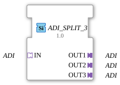

# ADI_SPLIT_3

* * * * * * * * * *
## Introduction

The function block **ADI_SPLIT_3** is used to distribute an incoming ADI data stream (adapter interface) to three identical outputs. It is designed as a generic function block and enables simple signal multiplication in adapter-based 4diac applications.
## Interface Structure

The function block has only adapter interfaces – neither event nor data inputs/outputs are present.

### **Event Inputs**

None.

### **Event Outputs**

None.

### **Data Inputs**

None.

### **Data Outputs**

None.

### **Adapter**

| Name | Type | Direction | Description |
|-------------|-----|----------|--------------|
| `IN` | `adapter::types::unidirectional::ADI` | Socket (Input) | Incoming ADI data stream that is split. |
| `OUT1` | `adapter::types::unidirectional::ADI` | Plug (Output) | First outgoing ADI data stream (copy of the input). |
| `OUT2` | `adapter::types::unidirectional::ADI` | Plug (Output) | Second outgoing ADI data stream. |
| `OUT3` | `adapter::types::unidirectional::ADI` | Plug (Output) | Third outgoing ADI data stream. |

## Functionality

The function block forwards all ADI data packets arriving at its socket `IN` unchanged to the three output plugs `OUT1`, `OUT2`, and `OUT3`. No processing or buffering takes place – distribution occurs directly and without delay. This behavior corresponds to passive signal multiplication (1:N splitter).

## Technical Features

- **Generic Type:** The function block is defined using a generic class name (`GEN_ADI_SPLIT`), allowing it to be reused for any ADI-compliant data type.
- **Type Hash:** An empty type hash is stored, indicating a simple, unparameterized implementation.
- **No Runtime Logic:** Since neither event nor data interfaces exist, the function block is entirely controlled by the adapter connections and does not require its own ECC (Execution Control Chart).

## State Overview

The function block has no internal states. Its functionality is limited to passively passing through adapter data – therefore, there is no state machine.

## Application Scenarios

- **Signal Distribution in Control Systems:** When an ADI sensor value needs to be sent simultaneously to multiple consumers (e.g., visualization, control, logging).
- **Test and Simulation Environments:** A real ADI signal can be distributed to various test modules or simulation components using `ADI_SPLIT_3` without having to access the source multiple times.
- **Redundancy and Safety Concepts:** Distribution of a safety-critical signal to multiple independent evaluation units.

## Comparison with Similar Components

- **`ADI_SPLIT_2`** – Splits to two outputs, otherwise identical functionality.
- **`ADI_MERGE`** – Combines multiple ADI inputs into one output (counterpart to the splitter).
- **`ADI_SELECT`** – Selects one of several ADI inputs based on a control signal (not pure distribution).

The `ADI_SPLIT_3` is specifically optimized for situations where exactly three identical copies of an ADI signal are required. If more or fewer outputs are needed, other splitter variants or combinations can be used.

## Change Detection

Each output plug is updated independently: the incoming value is written to a given output, and its adapter event sent, only if it differs from that output's current value. Outputs that are already in sync stay quiet, while an output that was just connected (or has drifted out of sync) still receives the update it needs.

## Conclusion

The **ADI_SPLIT_3** is a simple yet useful generic building block for multiplying ADI data streams in three directions. Its pure adapter interface allows for seamless integration into existing 4diac projects without requiring additional event or data processing. It is particularly well-suited for passive signal distribution in modular, adapter-based automation solutions.

---

### 🌐 Related topic subpages on ms-muc-docs.de

- [🌐 Eclipse 4diac IDE & Color Reference on ms-muc-docs.de](https://www.ms-muc-docs.de/iec-61499/eclipse-4diac/)

]
