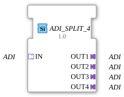

# ADI_SPLIT_4

* * * * * * * * * *
## Introduction
The function block **ADI_SPLIT_4** serves as a generic splitter for a single ADI data stream. It receives one ADI input via the socket interface `IN` and makes it available to four identical ADI outputs via the plug interfaces `OUT1`, `OUT2`, `OUT3`, and `OUT4`. This block is ideal when an ADI signal needs to be forwarded in parallel to several subsequent components.
## Interface Structure

### **Event Inputs**

None.

### **Event Outputs**

None.

### **Data Inputs**

None.

### **Data Outputs**

None.

### **Adapters**

| Type | Name | Direction | Description |

|-----------|--------|----------|-------------|

| `ADI` (unidirectional) | `IN` | Socket | Receives the ADI data stream to be distributed. |

| `ADI` (unidirectional) | `OUT1` | Plug | First output – identical copy of the input signal. |

| `ADI` (unidirectional) | `OUT2` | Plug | Second output – identical copy of the input signal. |

| `ADI` (unidirectional) | `OUT3` | Plug | Third output – identical copy of the input signal. |

| `ADI` (unidirectional) | `OUT4` | Plug | Fourth output – identical copy of the input signal. |

## Functionality

This module functions as a simple **replication** of the ADI signal. As soon as a valid ADI data stream is present at socket `IN`, it is passed on unchanged and without delay to all four plugs (`OUT1` … `OUT4`). No logic, filtering, or data manipulation takes place – the behavior is that of a passive signal distributor.

Since this is a generic function block (FB), the underlying ADI type is only determined at runtime or when it is integrated into a project. The interface definition itself is type-independent.

## Technical Features
- **Generic Type** – The function block is declared as `GEN_ADI_SPLIT` and can be instantiated with any specific ADI adapter type.
- **No Events** – Signal distribution occurs purely via the adapter interfaces; there are no event inputs or outputs.
- **Scalability** – The function block is fixed at exactly four outputs. Alternative versions (e.g., `ADI_SPLIT_2`) are available for other numbers.

## State Overview

The function block does not have an explicit state machine (ECC). Since it only implements passive signal transmission, no internal state is required.

## Application Scenarios
- **Parallel Operation** – An ADI data stream provided by a sensor or predecessor function block is to be used simultaneously by multiple actuators, logic blocks, or visualization components.
- **Prototyping** – During the development phase, the splitter allows for easy testing of multiple paths of the same signal.
- **Redundancy** – The ADI signal can be distributed to multiple redundant evaluation paths.

## Comparison with Similar Function Blocks
- **ADI_SPLIT_2** – Distributes one ADI signal to two outputs. Identical functionality, but fewer outputs.
- **ADI_MERGE** – Combines multiple ADI inputs into one output (counterpart to the splitter).
- **Manual Wiring** – Alternatively, distribution could be achieved by connecting multiple outputs to the same output; however, the splitter in the 4diac IDE is the cleaner and reusable solution.

## Conclusion

The **ADI_SPLIT_4** is a simple yet useful generic function block for multiplying an ADI data stream. It requires no configuration and integrates seamlessly into modular automation projects. Its adapter-based interface ensures flexibility and allows it to be integrated into different environments without modifications to its internal logic.

---

### 🌐 Related topic subpages on ms-muc-docs.de
* [🌐 Eclipse 4diac IDE & Color Reference on ms-muc-docs.de](https://www.ms-muc-docs.de/iec-61499/eclipse-4diac/)

]