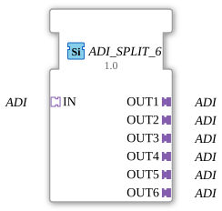

# ADI_SPLIT_6

* * * * * * * * * *

## Introduction

The ADI_SPLIT_6 function block is used to distribute a single (unidirectional) ADI adapter input to six identical ADI adapter outputs. It is designed as a generic building block for the Eclipse 4diac framework and is typically used when an ADI signal needs to be forwarded to multiple downstream components.

## Interface Structure

### **Event Inputs**

No event inputs available.

### **Event Outputs**

No event outputs available.

### **Data Inputs**

No data inputs available.

### **Data Outputs**

No data outputs available.

### **Adapters**

The module communicates exclusively via adapter interfaces:

**Socket (Input):**

- `IN`: Type `adapter::types::unidirectional::ADI` – receives a unidirectional ADI signal.

**Plugs (Outputs):**

- `OUT1` to `OUT6`: each type `adapter::types::unidirectional::ADI` – pass the incoming signal identically to six parallel outputs.

## Functionality

The module performs a simple 1:6 distribution of the ADI adapter signal. All data and events arriving at socket `IN` are passed on unchanged and simultaneously to all six plugs `OUT1`…`OUT6`. No buffering, filtering, or delay occurs. The function block thus operates as a passive splitter at the adapter level.

## Technical Features

- **Generic Implementation:** The function block is implemented as a generic block (`eclipse4diac::core::GenericClassName = 'GEN_ADI_SPLIT'`) and can be reused in various projects.
- **Unidirectional Adapters:** The ADI adapters used are unidirectional; feedback via the outputs is not provided.
- **No Internal States:** Since the function block does not perform any event or data processing, it does not have an internal state machine.
- **Performance:** Due to the direct forwarding without logic or memory, there is virtually no latency.

## State Overview

This function block does not have a state machine or explicit operating states. It is always active and immediately passes the input signal to all outputs.

## Application Scenarios

- **Signal Distribution in Control Systems:** An ADI signal provided by a sensor or central logic unit is to be sent in parallel to multiple actuators, displays, or downstream functions.
- **Test Environments:** During simulation or debugging, a single signal can be split across multiple receivers to test different components simultaneously.
- **Redundancy Mapping:** If a signal is needed multiple times (e.g., for monitoring and control paths), this splitter can provide clean decoupling of the outputs.

## Comparison with Similar Function Blocks

- **SPLIT for Standard Data Types:** Many frameworks offer splitters for simple data types (e.g., `SPLIT_INT`). The `ADI_SPLIT_6` function block is specifically designed for the `ADI` adapter type and operates at a higher level of abstraction (adapters instead of individual data points).
- **ADI_MERGE / ADI_COMBINE:** While this function block distributes a signal, other function blocks combine multiple adapter inputs into a single output.
- **Other Splitter Variants:** Splitters may exist for other adapter types (e.g., bidirectional ADI). This function block is limited to unidirectional signals.

## Change Detection

Each output plug is updated independently: the incoming value is written to a given output, and its adapter event sent, only if it differs from that output's current value. Outputs that are already in sync stay quiet, while an output that was just connected (or has drifted out of sync) still receives the update it needs.

## Conclusion

The `ADI_SPLIT_6` function block is a simple yet effective function block for multiplying unidirectional ADI adapter signals. Its generic design and low complexity make it ideally suited for the modular development of control applications in the Eclipse 4diac environment. Its applications range from simple signal distribution to testing and redundancy scenarios.

---

### 🌐 Related topic subpages on ms-muc-docs.de

- [🌐 Eclipse 4diac IDE & Color Reference on ms-muc-docs.de](https://www.ms-muc-docs.de/iec-61499/eclipse-4diac/)

]
