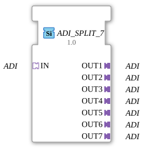

# ADI_SPLIT_7

* * * * * * * * * *
The function block **ADI_SPLIT_7** is used to split an incoming **ADI** adapter signal into seven identical outputs. It is implemented as a generic function block (Generic FB) and enables the unidirectional distribution of data via one adapter socket to seven adapter plugs.

None – the function block has no event inputs. Data is transmitted exclusively via the adapter interface.

None – the function block has no event outputs. The output adapters are supplied directly with the received data.

None – the data is not provided via separate data inputs, but rather via the adapter socket IN.

None – the data is not output via separate data outputs, but rather via the adapter plugs OUT1 … OUT7.

### Data Outputs
### Data Inputs
### Event Outputs
### Event Inputs
## Interface Structure
## Introduction
### **Adapters**

| Name | Direction | Type | Description |
|------|----------|-----|--------------|
| IN | Socket | adi (unidirectional) | Input adapter that receives the data to be distributed. |
| OUT1 | Plug | adi (unidirectional) | First output adapter (identical to IN). |
| OUT2 | Plug | adi (unidirectional) | Second output adapter (identical to IN). |
| OUT3 | Plug | adi (unidirectional) | Third output adapter (identical to IN). |
| OUT4 | Plug | adi (unidirectional) | Fourth output adapter (identical to IN). |
| OUT5 | Plug | ADI (unidirectional) | Fifth output adapter (identical to IN). |
| OUT6 | Plug | ADI (unidirectional) | Sixth output adapter (identical to IN). |
| OUT7 | Plug | ADI (unidirectional) | Seventh output adapter (identical to IN). |

## Functionality

This component functions as a **1-to-7 splitter** for ADI adapter signals. When the signal is set at the input adapter **IN**, it is copied to all seven output adapters **OUT1** to **OUT7** without further processing or delay. The component has no internal logic or state machine – it simply passes the data on passively.

- **Generic component** – the type is instantiated as `GEN_ADI_SPLIT` and can be reused in various applications.

- **No Event Control** – Data transmission is purely data-driven without event inputs/outputs.
- **1:1 Copy** – The data at the input is transferred unchanged to all outputs.

The module has **no state machine** (ECC). It is stateless, meaning it does not react to events and has no internal states. The output data directly follows the input data.

- **Signal Distribution** – A single ADI signal (e.g., sensor value, control signal) must be distributed to multiple consumers (e.g., control blocks, visualizations).
- **Redundancy** – A signal is required for redundant processing paths.
- **Test and Simulation Environments** – an incoming signal is split for different test instances.

| Function Block | Number of Outputs | Properties |
|----------|-----------------|---------------|
| ADI_SPLIT_2 | 2 | Distributes 1 ADI to 2 outputs |
| ADI_SPLIT_4 | 4 | Distributes 1 ADI to 4 outputs |
| ADI_SPLIT_7 | 7 | Distributes 1 ADI to 7 outputs |
| ADI_MERGE | 1 (Input: multiple) | Combines multiple ADI inputs into one output |

Compared to manually connecting multiple ADI_Split function blocks in parallel, the `ADI_SPLIT_7` reduces configuration effort and improves network clarity.

The `ADI_SPLIT_7` is a simple yet powerful component for distributing a unidirectional ADI signal to seven identical outputs. Thanks to its generic implementation and the absence of event-driven control, it is ideally suited for pure distribution in automation and control environments based on the ADI adapter protocol.

---

* [🌐 Total resistance in series & parallel circuits on ms-muc-docs.de ](https://www.ms-muc-docs.de/elektrotechnik/elektrik/widerstand/widerstand-theorie/gesamtwiderstand-reihen-parallelschaltung/)

## Technical Features
## State Overview
## Application Scenarios
## Comparison with Similar Function Blocks
## Conclusion
### 🌐 Passende Themen-Unterseiten auf ms-muc-docs.de