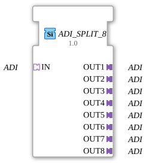

# ADI_SPLIT_8

* * * * * * * * * *
## Introduction
The function block `ADI_SPLIT_8` is used to split a single unidirectional ADI (Application Data Interface) adapter into eight identical output adapters. It is implemented as a generic block that can be adapted to different ADI contexts by specifying a `GenericClassName` attribute. The function block simplifies signal distribution in control applications by distributing an incoming adapter path to multiple receivers without data loss.
## Interface Structure

### **Event Inputs**

There are no event inputs. Data is passed continuously and without events via a direct adapter connection.

### **Event Outputs**

There are no event outputs.

### **Data Inputs**

No data inputs in the conventional sense are defined. Information is transmitted exclusively via the adapter interfaces.

### **Data Outputs**

No data outputs are available.

### **Adapters**

| Direction | Name | Type | Description |

|----------|-------|------------------|-------------------------------------------------|

| Socket | IN | ADI (unidirectional) | Input interface distributed to eight outputs. |

| Plug | OUT1 | ADI (unidirectional) | First outgoing adapter (identical to IN). |

| Plug | OUT2 | ADI (unidirectional) | Second outgoing adapter. |

| Plug | OUT3 | ADI (unidirectional) | Third outgoing adapter. |

| Plug | OUT4 | ADI (unidirectional) | Fourth outgoing adapter. |

| Plug | OUT5 | ADI (unidirectional) | Fifth outgoing adapter. |

Plug | OUT6 | ADI (unidirectional) | Sixth outgoing adapter. |

Plug | OUT7 | ADI (unidirectional) | Seventh outgoing adapter. |

Plug | OUT8 | ADI (unidirectional) | Eighth outgoing adapter. |

## Functionality

The function block forwards the ADI adapter arriving via socket `IN` unchanged to all eight `OUT` plugs. Each output represents an independent, but identical copy of the incoming adapter. Distribution occurs directly – there is no buffering, delay, or transformation. Changes to the `IN` adapter are immediately propagated to all `OUT` adapters. The function block operates purely combinatorially and requires no clocking or initialization.

## Technical Features
- **Generic Type**: The FB can be parameterized to various specific ADI implementations using the attribute `eclipse4diac::core::GenericClassName`. By default, the class name is set to `'GEN_ADI_SPLIT'`.
- **No State Management**: The FB has no internal memory or state machines; it acts as a simple signal distributor.
- **Unidirectionality**: All adapters are unidirectional – data flows only from the socket to the plugs. Feedback is not provided.
- **No Event Control**: Distribution occurs without events, which increases runtime determinism.

## State Overview

The `ADI_SPLIT_8` FB has no internal states or an ECC (Execution Control Chart). It behaves statically and performs the same function at all times. Therefore, a state overview is unnecessary.

## Application Scenarios
- **Signal Broadcasting**: Distributing a measured value or control signal (e.g., temperature, speed) to multiple parallel control loops.
- **Adapter Multiplexing**: Providing a central ADI path for multiple subsystems that require the same data stream.
- **Test and Simulation Environments**: Feeding a simulated signal to multiple receiver blocks simultaneously.
- **Modular Automation Architectures**: Creating redundant or parallel processing paths by simply duplicating adapter connections.

## Comparison with Similar Components
- **SPLIT (Data-Event Variant)**: Classic split components (e.g., `E_SPLIT`) distribute events or data values, but not entire adapter paths. `ADI_SPLIT_8` operates at a higher level of abstraction (adapter level).
- **FORK FBs**: Some IEC 61499 implementations offer fork blocks for adapters, but these are often event-driven. This FB is distinguished by its absence of events and its fixed number of eight outputs.
- **Manual Wiring**: Without this FB, each destination connection would have to be implemented individually via coupling adapters or manual branching – more complex and prone to errors.

## Conclusion

`ADI_SPLIT_8` is a powerful, generic split block for unidirectional ADI adapters in IEC 61499 applications. It significantly reduces wiring effort, improves clarity, and allows for the easy duplication of an adapter path. Thanks to its generic parameterization and event-free operation, it is particularly well-suited for data-driven automation systems that require reliable, low-latency signal distribution.

---

### 🌐 Related topic subpages on ms-muc-docs.de
* [🌐 Eclipse 4diac IDE & Color Reference on ms-muc-docs.de](https://www.ms-muc-docs.de/iec-61499/eclipse-4diac/)

]