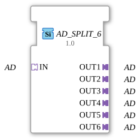

# AD_SPLIT_6

* * * * * * * * * *
## Introduction
The function block **AD_SPLIT_6** distributes an incoming adapter of type `adapter::types::unidirectional::AD` to six separate output adapters of the same type. It is designed as a generic function block that implements a simple 1:6 split without additional logic or state management.
## Interface Structure
### **Event Inputs**
None.

### **Event Outputs**
None.

### **Data Inputs**
None.

### **Data Outputs**
None.

### **Adapter**

| Type | Name | Direction | Description |

|-----|------|-----------|--------------|
| `adapter::types::unidirectional::AD` | IN | Socket | Input adapter that distributes the signal to the six outputs. |

| `adapter::types::unidirectional::AD` | OUT1 | Plug | First output adapter (identical to IN). |

| `adapter::types::unidirectional::AD` | OUT2 | Plug | Second output adapter. |

| `adapter::types::unidirectional::AD` | OUT3 | Plug | Third output adapter. |

| `adapter::types::unidirectional::AD` | OUT4 | Plug | Fourth output adapter. |

| `adapter::types::unidirectional::AD` | OUT5 | Plug | Fifth output adapter. |

| `adapter::types::unidirectional::AD` | OUT6 | Plug | Sixth output adapter. |

## Functionality

The function block forwards the adapter received via socket **IN** unchanged to all six plugs (**OUT1** to **OUT6**). No data manipulation, filtering, or delay occurs. The adapter is multiplied by reference or by direct coupling (depending on the runtime environment) to the outputs. Thus, all connected subsequent function blocks receive the same adapter content.

## Technical Features
- **Generic Function Block**: The attribute `eclipse4diac::core::GenericClassName` is set to `'GEN_AD_SPLIT'`, enabling reuse in various type configurations.
- **No Events or Data**: The function block operates exclusively via adapter interfaces; events or direct data connections are not required.
- **Simple Topology**: The 1:6 distribution is hard-coded and cannot be dynamically adjusted.

## State Overview
The function block has no internal states or state machines. It behaves passively and continuously passes the input value to all outputs. There are no time constraints or mode switching.

## Application Scenarios
- **Signal distribution** in control applications where an AD adapter interface needs to be distributed to multiple downstream components.
- **Test and simulation setups** for monitoring and processing a data stream in parallel.
- **Bus-like architectures** where multiple devices need to receive identical adapter information.

## Comparison with Similar Components
Other split components such as `AD_SPLIT_2`, `AD_SPLIT_4`, or `AD_SPLIT_8` differ only in the number of outputs. `AD_SPLIT_6`, with six outputs, offers a middle ground between these variants. Components with additional logic (e.g., conditional distribution) also exist, but this is not the case here.

## Conclusion

`AD_SPLIT_6` is a simple yet useful generic function block for 1:6 distribution of an AD adapter. Its clear interface and lack of state logic make it easy to understand and efficient for distribution tasks in IEC 61499-based applications.

---

### 🌐 Related topic subpages on ms-muc-docs.de
* [🌐 Eclipse 4diac IDE & color reference on ms-muc-docs.de ](https://www.ms-muc-docs.de/iec-61499/eclipse-4diac/)
