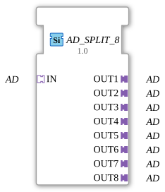

# AD_SPLIT_8

* * * * * * * * * *

## Introduction

The function block **AD_SPLIT_8** is a generic function block for splitting an incoming unidirectional AD adapter signal into eight separate outputs. It enables the distribution of an analog or digital signal to multiple downstream components without altering the signal.

## Interface Structure

### **Event Inputs**

None

### **Event Outputs**

None

### **Data Inputs**

None

### **Data Outputs**

None

### **Adapter**

| Direction | Name | Type | Description |

|----------|-----|-----|--------------|

| Socket | **IN** | `adapter::types::unidirectional::AD` | Input Adapter – Signal to be Split |

| Plug | **OUT1** | `adapter::types::unidirectional::AD` | First Output |

| Plug | **OUT2** | `adapter::types::unidirectional::AD` | Second Output |

| Plug | **OUT3** | `adapter::types::unidirectional::AD` | Third Output |

| Plug | **OUT4** | `adapter::types::unidirectional::AD` | Fourth Output |

| Plug | **OUT5** | `adapter::types::unidirectional::AD` | Fifth Output |

| Plug | **OUT6** | `adapter::types::unidirectional::AD` | Sixth Output |

| Plug | **OUT7** | `adapter::types::unidirectional::AD` | Seventh Output |

| Plug | **OUT8** | `adapter::types::unidirectional::AD` | Eighth Output |

## Functionality

This function block forwards the signal present at socket **IN** unchanged to all eight plugs **OUT1** through **OUT8**. No signal processing, delay, or logical modification takes place. Distribution occurs continuously and without event triggering.

## Technical Features

- **Generic Type**: Depending on the project definition, the adapter type `adapter::types::unidirectional::AD` can represent any unidirectional signal (e.g., analog value, byte, structure).

- **No Event Control**: The function block operates purely data-driven (adapter flow) – no INIT, RSP, or other events are required.

- **Compatibility**: Required import declarations for `eclipse4diac::core::GenericClassName` and `eclipse4diac::core::TypeHash` are included in the CompilerInfo.

- **Scalability**: By adjusting the generic parameters, similar function blocks with different output numbers can be created.

## State Overview

This function block does not have a state machine (ECC). It operates statically and does not adapt its output behavior to different operating modes.

## Application Scenarios

- **Sensor Distribution**: A single analog sensor value (e.g., temperature) is passed on to multiple control modules in parallel.

- **Signal Provision for Visualization and Control**: The same A/D signal is sent simultaneously to a higher-level controller and an operator panel.

- **Redundant Data Supply**: In safety-critical applications, the signal can be split across multiple independent paths.

## Comparison with Similar Function Blocks

- **AD_SPLIT_2, AD_SPLIT_4** – Function blocks with similar functionality but fewer outputs.

- **AD_ROUTER** – A function block that selectively routes the incoming signal to one of several outputs.

- **AD_MULTIPLEXER** – Combines multiple inputs into one output (in reverse direction).

Unlike these function blocks, **AD_SPLIT_8** does not perform any selection – all outputs always receive the same signal.

## Conclusion

**AD_SPLIT_8** is a simple yet essential function block in IEC 61499 systems that implements signal distribution via adapter interfaces without additional logic or runtime costs. Its generic nature makes it flexible and facilitates the modular structuring of automation projects.

---

### 🌐 Related topic subpages on ms-muc-docs.de

* [🌐 Eclipse 4diac IDE & color reference on ms-muc-docs.de](https://www.ms-muc-docs.de/iec-61499/eclipse-4diac/)

]