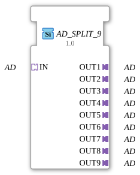

# AD_SPLIT_9

* * * * * * * * * *
## Introduction

The function block **AD_SPLIT_9** distributes an incoming unidirectional adapter (AD) signal to nine identical outputs. It is implemented as a generic function block and is suitable for reusing an adapter signal in various downstream components.
## Interface Structure

### **Event Inputs**

No event inputs available.

### **Event Outputs**

No event outputs available.

### **Data Inputs**

No data inputs available.

### **Data Outputs**

No data outputs available.

### **Adapter**

| Name | Type | Direction |
|------|-----|----------|
| IN | adapter::types::unidirectional::AD | Socket (Input) |
| OUT1 | adapter::types::unidirectional::AD | Plug (Output) |
| OUT2 | adapter::types::unidirectional::AD | Plug (Output) |
| OUT3 | adapter::types::unidirectional::AD | Plug (Output) |
| OUT4 | adapter::types::unidirectional::AD | Plug (Output) |
| OUT5 | adapter::types::unidirectional::AD | Plug (Output) |
| OUT6 | adapter::types::unidirectional::AD | Plug (Output) |
| OUT7 | adapter::types::unidirectional::AD | Plug (Output) |
| OUT8 | adapter::types::unidirectional::AD | Plug (Output) |
| OUT9 | adapter::types::unidirectional::AD | Plug (Output) |

## Functionality

The function block (FB) performs a **1:n distribution** of the incoming adapter signal. Each of the nine output adapters (OUT1 … OUT9) provides exactly the same data as the input adapter (IN). Since the FB has neither event nor data inputs, signal transmission is purely structural: the connection between IN and all OUTs is defined at configuration time and transparently passed on at runtime.

## Technical Features

- **Generic Block**: The FB carries the attribute `eclipse4diac::core::GenericClassName` with the value `'GEN_AD_SPLIT'`, thus serving as a placeholder for type-specific instantiation.
- **Type Binding**: All adapters are of type `adapter::types::unidirectional::AD` – a standardized unidirectional adapter interface.
- **No Event Control**: Distribution occurs without time synchronization or events; changes to the input signal are immediately passed on to all outputs.

## State Overview

The FB has no internal state machine and executes no sequential logic. Its behavior is **purely combinatorial**.

## Application Scenarios

- **Signal Multiplexing**: An adapter provided by a sensor or controller is to be connected to multiple independent evaluation units (e.g., visualization, logging, alarm generation).
- **Modular Architecture**: In an IEC 61499-based application, a central data provider can distribute its information via `AD_SPLIT_9` to up to nine different submodules without duplicating the source logic.

## Comparison with Similar Function Blocks

- **AD_SPLIT_2 / AD_SPLIT_4 / AD_SPLIT_8**: These function blocks offer the same functionality, but with fewer outputs (2, 4, 8). `AD_SPLIT_9` complements the portfolio for applications requiring exactly nine parallel outputs.
- **Other Split Function Blocks**: Data type-oriented split function blocks (e.g., for INTEGER or BOOL) split individual data values, while `AD_SPLIT_9` replicates complete adapter structures. The adapter can bundle multiple related data and events.

## Change Detection

Each output plug is updated independently: the incoming value is written to a given output, and its adapter event sent, only if it differs from that output's current value. Outputs that are already in sync stay quiet, while an output that was just connected (or has drifted out of sync) still receives the update it needs.

## Conclusion

AD_SPLIT_9` is a simple yet useful generic function block for unidirectionally splitting an adapter signal into nine identical outputs. It helps avoid redundancy in system design and facilitates the modular structuring of IEC 61499 applications.

---

### 🌐 Related topic subpages on ms-muc-docs.de

* [🌐 Eclipse 4diac IDE & Color Reference on ms-muc-docs.de](https://www.ms-muc-docs.de/iec-61499/eclipse-4diac/)

]
