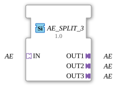

# AE_SPLIT_3

* * * * * * * * * *
## Introduction
The function block **AE_SPLIT_3** is used to distribute an incoming adapter data stream (of type `AE`) to three identical outputs. It is implemented as a generic function block and allows for the flexible use of different adapter types through design-time configuration.
## Interface Structure

### **Event Inputs**
None.

### **Event Outputs**
None.

### **Data Inputs**
None.

### **Data Outputs**
None.

### **Adapter**

| Direction | Name | Type | Description |
|----------|------|-----|--------------|
| Socket (Input) | IN | `adapter::types::unidirectional::AE` | Incoming adapter data stream, distributed to the three outputs. |
| Connector (Output) | OUT1 | `adapter::types::unidirectional::AE` | First output – receives the same data as the input. |
| Connector (Output) | OUT2 | `adapter::types::unidirectional::AE` | Second output – receives the same data as the input. |
| Connector (Output) | OUT3 | `adapter::types::unidirectional::AE` | Third output – receives the same data as the input. |

## Functionality

The function block accepts a unidirectional adapter data stream of type `AE` via socket `IN`. Each incoming data packet or event is forwarded without modification to all three adapter plugs (`OUT1`, `OUT2`, `OUT3`). No processing or preparation of the data takes place – the function block acts purely as a **signal distributor** for adapter connections.

The function block accepts a unidirectional adapter data stream of type `AE` via socket `OUT1`, `OUT2`, and `OUT3`. Thanks to the generic design (`eclipse4diac::core::GenericClassName = 'GEN_AE_SPLIT'`), the specific adapter type (e.g., a user-defined AE subtype) can be defined at design time for `IN`, `OUT1`–`OUT3`. At runtime, all instances are identically typed.

## Technical Features
- **Generic Component** – The adapter type is only defined during instantiation in the project, which increases reusability and type safety.
- **Unidirectional Communication** – Data flows only from the input to the outputs; reverse communication is not supported.
- **License** – The component is licensed under the **Eclipse Public License 2.0 (EPL-2.0)**, which permits free use, modification, and distribution.
- No event- or data-based inputs/outputs – all communication takes place exclusively via the adapter interfaces.

## State Overview

The function block does not have an internal state diagram (ECC). It operates **combinatorically**: Any change at the input is immediately and without delay passed on to all outputs.

## Application Scenarios
- **Signal Multiplication** – An adapter data stream provided by a sensor (e.g., `AE_Temperature`) is to be sent in parallel to three different evaluation units.
- **Distribution of Event Adapters** – In automation systems that rely on adapter-based communication, this allows multiple receivers to be served.
- **Test and Simulation Environments** – A data stream is distributed across multiple monitoring or logging modules.

## Comparison with Similar Function Blocks

| Function Block | Number of Outputs | Special Features |
|----------|-----------------|--------------|
| `AE_SPLIT_2` | 2 | Distributed to two outputs. |
| `AE_SPLIT_3` | 3 | Distributed to three outputs (existing FB). |
| `AE_SPLIT_N` (hypothetical) | variable | Flexible number via parameters – requires more configuration effort. |

All variants have in common that they operate solely at the adapter level and do not manipulate any data.

## Conclusion

The **AE_SPLIT_3** is a simple yet indispensable function block for duplicating adapter connections in the 4diac IDE. Its generic design and clear, unidirectional structure make it a maintainable tool for signal distribution without additional logic. Thanks to the EPL 2.0 license, it can be used in your own projects without restrictions.

---

### 🌐 Related topic subpages on ms-muc-docs.de
* [🌐 Eclipse 4diac IDE & Color Reference on ms-muc-docs.de](https://www.ms-muc-docs.de/iec-61499/eclipse-4diac/)

]
