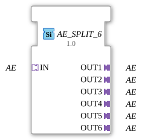

# AE_SPLIT_6

* * * * * * * * * *
## Introduction
The function block **AE_SPLIT_6** distributes an incoming AE adapter (type `adapter::types::unidirectional::AE`) to six identical outputs. It is a generic function block that can be reused for various AE types. The name derives from the 1:6 split: one input is split into six outputs.
## Interface Structure
### **Event Inputs**
None.

### **Event Outputs**
None.

### **Data Inputs**
None.

### **Data Outputs**
None.

### **Adapter**

| Direction | Name | Type | Description |

|----------|-----|-----|--------------|

| **Socket (Input)** | IN | `adapter::types::unidirectional::AE` | Incoming AE adapter, whose signal is duplicated to all outputs. |

| **Plug (Output)** | OUT1 | `adapter::types::unidirectional::AE` | First output, identical copy of the input signal. |

| **Plug (Output)** | OUT2 | `adapter::types::unidirectional::AE` | Second output, identical copy of the input signal. |

| **Plug (Output)** | OUT3 | `adapter::types::unidirectional::AE` | Third output, identical copy of the input signal. |

| **Plug (Output)** | OUT4 | `adapter::types::unidirectional::AE` | Fourth output, identical copy of the input signal. |

| **Plug (Output)** | OUT5 | `adapter::types::unidirectional::AE` | Fifth output, identical copy of the input signal. |

| **Plug (Output)** | OUT6 | `adapter::types::unidirectional::AE` | Sixth output, identical copy of the input signal. |

## Functionality
The function block forwards the adapter signal present at socket **IN** unchanged to all six plugs (**OUT1** … **OUT6**). No logical processing, filtering, or delay takes place – the distribution is passive and instantaneous. Thus, the function block behaves like a pure 1:6 splitter for the unidirectional adapter type `AE`.

## Technical Features
- **Generic Block**: The function block (FB) is marked with the attribute `eclipse4diac::core::GenericClassName` as `'GEN_AE_SPLIT'`. This allows it to be used in different projects with different, but structurally identical, AE adapter types – the specific type is only determined at project runtime.
- **Unidirectionality**: All adapters are declared as unidirectional, meaning that data/event transfer only occurs from the input (socket) to the outputs (plugs). Feedback is not provided.
- **No State Logic**: The function block has no internal states, no events, and no data inputs/outputs. It is entirely defined by its adapter interfaces.

## State Overview
The FB **AE_SPLIT_6** is a purely combinational function block without a state machine. There are no internal steps, transitions, or actions – distribution is direct and permanent.

## Application Scenarios
- **Signal Distribution**: Several downstream function blocks should receive the same AE signal, e.g., to start parallel calculations or parallel output.
- **Bus Structure**: In a control architecture where an event must be sent to multiple components (actuators, displays, loggers) without burdening the source.
- **Adapter Networks**: When an AE adapter is provided by a sender and multiple receivers need to access it independently.

## Comparison with Similar Function Blocks
- **E_SPLIT Function Blocks**: These split an event signal (e.g., into **E_SPLIT** or **E_F_SPLIT**) across multiple event outputs. The **AE_SPLIT_6**, on the other hand, operates at the adapter level and distributes the entire adapter network, which can contain both events and data – depending on the specific adapter instantiation.
- **AE_SPLIT_2 / AE_SPLIT_4**: Variants with two or four outputs. The **AE_SPLIT_6** offers the maximum number of outputs in this family: six.
- **MUX/DEMUX blocks**: These select or combine signals. The **AE_SPLIT_6**, however, duplicates the signal without selection.

## Conclusion
The **AE_SPLIT_6** is a simple yet useful generic function block for the 1:6 distribution of a unidirectional AE adapter. Its generic design allows it to be used in a wide variety of automation and control environments where a signal is required multiple times. It operates without delay and without its own logic, making it particularly efficient and reliable.

**AE_SPLIT_6** ---

### 🌐 Related topic subpages on ms-muc-docs.de
* [🌐 Eclipse 4diac IDE & Color Reference on ms-muc-docs.de](https://www.ms-muc-docs.de/iec-61499/eclipse-4diac/)

]
