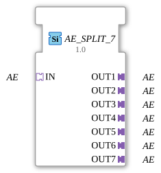

# AE_SPLIT_7

* * * * * * * * * *
## Introduction
The function block **AE_SPLIT_7** is used to distribute a single incoming adapter event (AE) to seven identical output adapters. It is a generic function block designed for unidirectional adapters of type `adapter::types::unidirectional::AE`. The function block enables star-shaped routing of an event signal to multiple downstream function blocks without modifying or delaying the events.

## Interface Structure
### **Event Inputs**
None – communication occurs exclusively via adapters.

#### **Event Outputs**
None – output occurs via adapters.

#### **Data Inputs**
None.

#### **Data Outputs**
None.

#### **Adapters**

| Type | Name | Direction | Description |
|-----|------|----------|--------------|

| `adapter::types::unidirectional::AE` | **IN** | Socket | Input adapter that receives the event to be distributed. |

| `adapter::types::unidirectional::AE` | **OUT1** | Plug | First output adapter; the received event is forwarded here. |

| `adapter::types::unidirectional::AE` | **OUT2** | Plug | Second output adapter. |

| `adapter::types::unidirectional::AE` | **OUT3** | Plug | Third output adapter. |

| `adapter::types::unidirectional::AE` | **OUT4** | Plug | Fourth output adapter. |

| `adapter::types::unidirectional::AE` | **OUT5** | Plug | Fifth output adapter. |

| `adapter::types::unidirectional::AE` | **OUT6** | Plug | Sixth output adapter. |

| `adapter::types::unidirectional::AE` | **OUT7** | Plug | Seventh output adapter. |

## Functionality

This function block is passive and forwards an incoming event at the input adapter **IN** unchanged to all seven output adapters **OUT1** to **OUT7**. The forwarding occurs simultaneously (logically parallel), meaning that after an event is received, all outputs are supplied with the same event. No buffering, prioritization, or data manipulation takes place. Since these are unidirectional adapters, data flow is only possible in one direction (from the socket to the plug).

## Technical Features

- **Generic Function Block:** The function block is declared as a generic type (`GEN_AE_SPLIT`) and can be used in various contexts with the corresponding adapter type. Type checking is performed at design time.

- **No Latency:** The event is passed through without delay; the runtime depends solely on the infrastructure of the IEC 61499 runtime system.

- **Type Identity:** All participating adapters must be of the same type (`AE` – unidirectional). Mixing different adapter types is not permitted.

- **No State Storage:** The function block (FB) has no internal memory – it only performs a one-to-many (1:n) forwarding.

## State Overview
Since the FB does not have its own state machine and operates solely reactively to incoming events, there is only one implicit state: **Ready**. In this state, input events are immediately passed to all outputs. There are no error states or start/stop logic.

## Application Scenarios

- **Event Distribution in Control Applications:** A single sensor or bus participant triggers an event that should simultaneously reach multiple actuators, alarms, or monitoring blocks.

- **Parallel Processing:** An event should be processed simultaneously in several independent function blocks, e.g., for redundancy or different evaluations.

- **Application Structuring:** Replaces multiple manual connection nodes and improves clarity in the network diagram.

## Comparison with Similar Function Blocks

- **AE\_SPLIT\_2, AE\_SPLIT\_3, ... :** These function blocks offer the same functionality but with fewer outputs. The choice depends on the required number.

- **E\_SPLIT (Event Splitter, Dataless):** A pure event splitter (without adapter encapsulation) distributes events but cannot handle adapter interfaces. The AE\_SPLIT\_7 is specifically designed for use with adapter types such as `AE`.

- **Adapter Merger (e.g., AE\_MERGE):** Combines multiple adapter events into one – the opposite of this function block.

## Conclusion
The **AE\_SPLIT\_7** is a simple yet useful function block for duplicating adapter events in IEC 61499 applications. Its generic nature, full event fidelity, and ease of use make it a fundamental tool for structured event distribution. It is ideally suited when an event needs to be forwarded to multiple similar target adapters and no data content is being transferred.