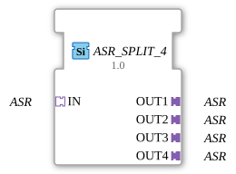

# ASR_SPLIT_4


* * * * * * * * * *
## Introduction
The function block **ASR_SPLIT_4** is a generic block that distributes an incoming unidirectional ASR adapter (actuator-control adapter) signal to four separate, identical ASR outputs. It enables the simultaneous control of up to four independent actuators or subsystems with the same signal without compromising signal integrity. The block is designed for use in distributed automation systems according to IEC 61499.
## Interface Structure
### **Adapter Inputs (Sockets)**

| Name | Type | Description |

|------|-----|--------------|

| IN | `adapter::types::unidirectional::ASR` | Input adapter providing the ASR connection to be distributed. |

### **Adapter Outputs (Plugs)**

| Name | Type | Description |

|------|-----|--------------|

| OUT1 | `adapter::types::unidirectional::ASR` | First output adapter (identical copy of the input). |

| OUT2 | `adapter::types::unidirectional::ASR` | Second output adapter. |

| OUT3 | `adapter::types::unidirectional::ASR` | Third output adapter. |

| OUT4 | `adapter::types::unidirectional::ASR` | Fourth output adapter. |

**Note:** The specific structure of the ASR adapter (event/data elements) is not defined within the function block itself, but is determined by the associated adapter type `adapter::types::unidirectional::ASR`. Typically, this includes control and feedback signals for drives.

## Functionality
The ASR_SPLIT_4 function block operates as a pure signal distributor: All ASR connection elements (events and data) received via the `IN` socket are replicated **1:1** to all four output plugs (OUT1–OUT4). No signal amplification, filtering, or logical processing takes place. As soon as the input adapter establishes an active connection, it is immediately passed through to all outputs. The function block does not require its own state logic – it operates entirely combinationally.

```
## Technical Features

- **Generic Function Block:** The function block is declared as a generic type (`GEN_ASR_SPLIT`), which means that the interface definition of the ASR adapter is resolved at compile time. It can be used with various versions of the ASR adapter, as long as they conform to the unidirectional protocol.
- **Unidirectional Signal Direction:** The adapters are designed as unidirectional, meaning data flows only from the input to the outputs (no return channel from output to input).
- **No Latency Buffering:** All outputs are supplied with the same signal simultaneously; there is no staggered timing or buffering.

## State Overview

The function block has **no explicit internal states**. The outputs always follow the input signals directly. There is no state machine. The behavior can be described as a single "switching" operation.

## Application Scenarios
- **Control of Multiple Parallel Drives:** A central drive command transmitter (e.g., an AGV control block) distributes the speed or direction signal to four independent motor controllers.
- **Redundant Signal Distribution:** In safety-critical systems, the same command can be sent to multiple redundant actuators to ensure fail-safe operation.
- **Test and Simulation Environments:** A simulated ASR signal is simultaneously applied to multiple test instances.

## Comparison with Similar Function Blocks
- **ASR_SPLIT_2 / ASR_SPLIT_N:** These function blocks split the ASR input into two or any number of outputs, respectively. The `ASR_SPLIT_4` is a special, four-channel variant.
- **Signal Multiplexer:** Unlike a true multiplexer, which selects from multiple sources, the split function block distributes the *same* source to multiple sinks.
- **Adapter Coupler:** Some libraries offer coupling blocks for adapter routing; the Split block extends this functionality to include multiplication.

## Conclusion
The **ASR_SPLIT_4** is a simple yet useful function block that enables the modular and reusable coupling of ASR adapter connections in IEC 61499 systems. Its generic implementation allows it to be used in various contexts where an input signal needs to be distributed to multiple identical output interfaces. Thanks to its adaptive, stateless design, it integrates seamlessly into event-driven automation architectures.
